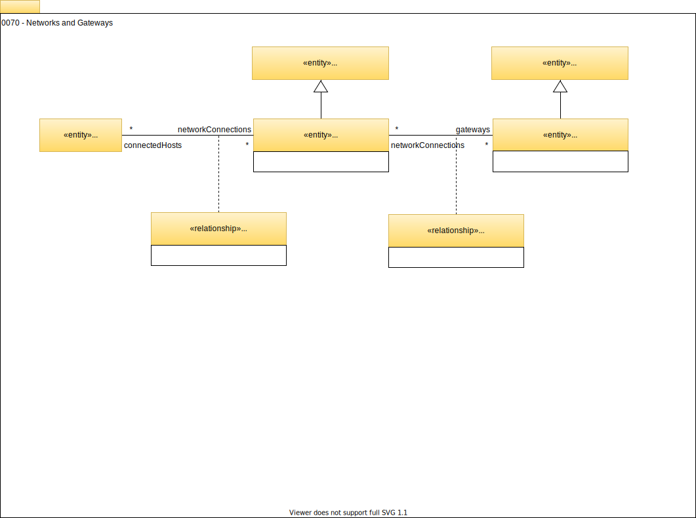

<!-- SPDX-License-Identifier: CC-BY-4.0 -->
<!-- Copyright Contributors to the Egeria project. -->

# 0070 Networks and Gateways

The network model for open metadata is very simple, to allow hosts to be grouped into the networks they are connected to. This can show details such as where hosts are isolated in private networks, and where the gateways onto the Internet are. 

--8<-- "snippets/abbr.md"
