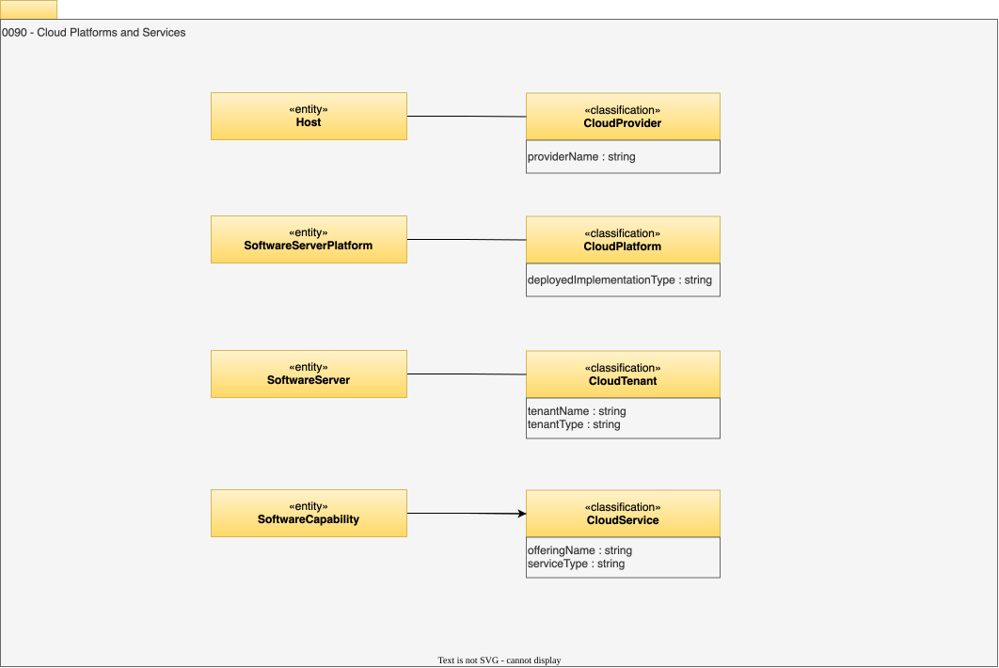

<!-- SPDX-License-Identifier: CC-BY-4.0 -->
<!-- Copyright Contributors to the Egeria project. -->

# 0090 Cloud Platforms and Services

The cloud platforms and services model shows that cloud computing is not so different from what we have been doing before. Cloud infrastructure and services are classified as such to show that the organization is not completely in control of the technology supporting their data and processes.

## CloudProvider

The *`CloudProvider`* is the organization that provides and runs the infrastructure for a cloud service. Typically, the host it offers is actually a [`HostCluster`](/types/0/0035-Complex-Hosts/#hostcluster). 

The cloud provider may offer infrastructure as a service (IaaS), in which case, an organization can deploy [`VirtualContainer`s](/types/0/0035-Complex-Hosts/#virtualcontainer) onto the cloud provider's `HostCluster`.

* *providerName* - Name of the cloud provider.

## CloudPlatform

The *CloudPlatform* classification indicates that a [*SoftwareServerPlatform*](/types/0/0037-Software-Server-Platforms) is running in a cloud service. The *deployedImplementationType* attribute describes the class of technology that describes the cloud platform implementation. Values for the *deployedImplementationType* attribute can be managed for consistency in a [*deployed implementation type*](/concepts/deployed-implementation-type) valid value set. If the cloud provider is offering platform as a service (PaaS), an application may deploy software servers and software capabilities onto the *CloudPlatform*.

* *deployedImplementationType* - Name of a particular type of technology. It is more specific than the open metadata types and increases the precision in which technology is catalogued. This helps human understanding and enables connectors and other actions to be targeted to the right technology.

## CloudService

The *CloudService* classification indicates that a [*SoftwareCapability*](/types/0/0042-Software-Capabilities)
If the cloud provider is offering Software as a Service (SaaS) then it has provided APIs backed by pre-deployed software capability that an organization can call as a *`CloudService`*.

* *offeringName* - Commercial name of the service.
* *serviceType* - Description of the type of the service.

## CloudTenant classification

A software server supporting cloud services.

* *tenantName* - Identifier of the tenant.
* *tenantType* - Description of the type of tenant.

--8<-- "snippets/abbr.md"
