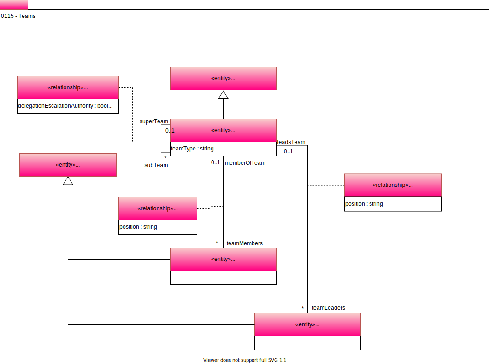

<!-- SPDX-License-Identifier: CC-BY-4.0 -->
<!-- Copyright Contributors to the Egeria project. -->

# 0115 Teams

A team is a group of people who are working to a common goal. The [ActorProfile](0110-actors.md) is extended to capture more information about a team. This is recorded in the Team entity.

The roles within the team divide into *Team Leader* and *Team Member*. A team can have multiple leaders and members. These roles extend from [PersonRole](0112-people.md) which links the role to the person appointed.

--8<-- "snippets/abbr.md"
