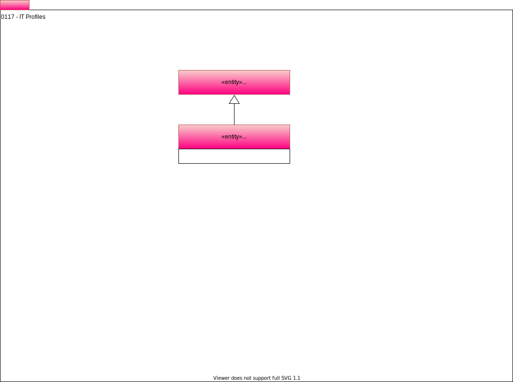

<!-- SPDX-License-Identifier: CC-BY-4.0 -->
<!-- Copyright Contributors to the Egeria project. -->

# 0117 IT Profiles

## ITProfile

Often ['engines'](../../../open-metadata-implementation/access-services/docs/concepts/server-capabilities/engine.md) and other IT infrastructure run as background processes with their own user identity. The ability to create an IT profile helps to identify which engine is responsible for specific metadata content.

--8<-- "snippets/abbr.md"
