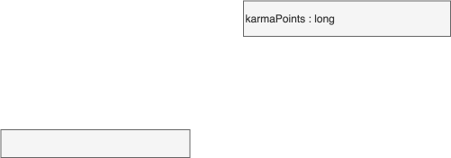

<!-- SPDX-License-Identifier: CC-BY-4.0 -->
<!-- Copyright Contributors to the Egeria project. -->

# 0125 Contribution

A key part of a successful governance program is ensuring that contributors are recognized - both the individuals and the automation that supports them.  The contribution record keeps track of the contribution of each actor in the form of [karma points](/concepts/karma-point).  Karma points are collected based on the user performing the work and then aggregated into the contribution record of the associated actor profile.

## ContributionRecord entity

The *ContributionRecord* accumulates achievements of an individual. Specifically Egeria supports [Karma Points](/concepts/karma-point). These are awarded for participation in open metadata and governance. The number of karma points awarded to the individual is recorded in their *ContributionRecord* entity.

- `isPublic` indicates whether the values in the contribution record can be shared with colleagues or is only visible to user(s) that connect with one of the linked user identities or systems that are part of the open metadata ecosystem.
- `karmaPoints` captures the total number of points that the actor has earned from their activity.

## Contribution relationship

The *Contribution* relationship links the contribution record to the actor profile for the individual or automation that is making the contribution.

--8<-- "snippets/abbr.md"
