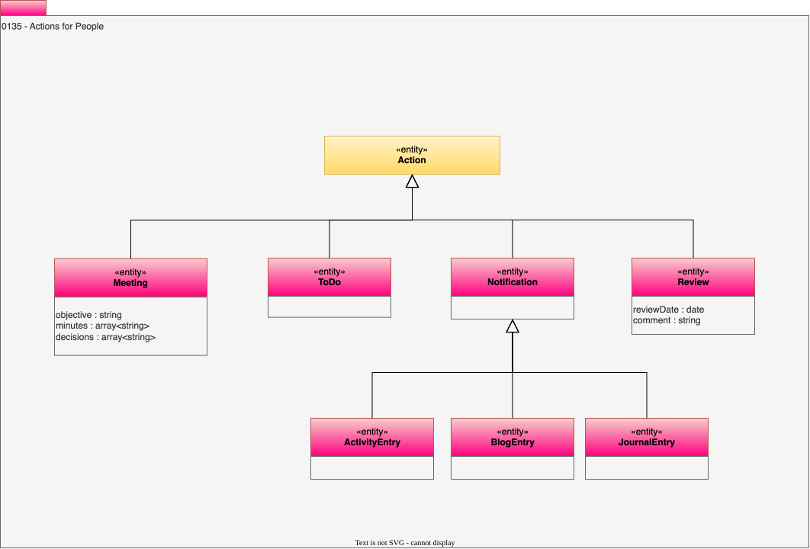

<!-- SPDX-License-Identifier: CC-BY-4.0 -->
<!-- Copyright Contributors to the Egeria project. -->

# 0135 Actions for People

In an ideal world, most governance activity is automated by the [Governance Actions](/concepts/governance-action). However, there are inevitably actions that require a person, or an external agent, to perform. These [actions](/types/0/0013-Actions) may be simply be to read some information, or to approve a change or something more substantial.  The [*Actor*](/types/1/0110-Actors) assigned to perform this work is linked via the [AssignmentScope](/types/1/0120-Assignment-Scopes) relationship.  When one action leads to another, these actions are linked via the [Actions](/types/0/0013-Actions) relationship.  The element, or elements they are to work on are linked via the [ActionTarget](/types/0/0013-Actions) relationship.

## Meetings

The *Meeting* entity records a meeting, say, for projects or the governance program.  The attendees (actors) for the meeting are assigned using *AssignmentScope*. 

## ToDo entity

The *ToDo* entity describes an item of work for an [*Actor*](/types/1/0110-Actors) to perform.

## Notification entity

The *Notification* describes information that needs to be passed to an actor.

## Review entity

The *Review* entity describes an assessment of the element(s) linked via the *ActionTarget* relationship.

* *reviewDate* - Date of the review.
* *comment* - Notes provided by the steward.

## ActivityEntry entity

Details of an activity performed by an actor.

## BlogEntry entity

Entry in a blog published by an actor.

## JournalEntry entity

Private journal entry by an actor.

## Meeting entity

Two or more people come together to discuss a topic, agree and action or exchange information.

* *objective* - Reason for the meeting and intended outcome.
* *minutes* - Description of what happened at the meeting.
* *decisions* - Decisions made during the meeting.

--8<-- "snippets/abbr.md"
