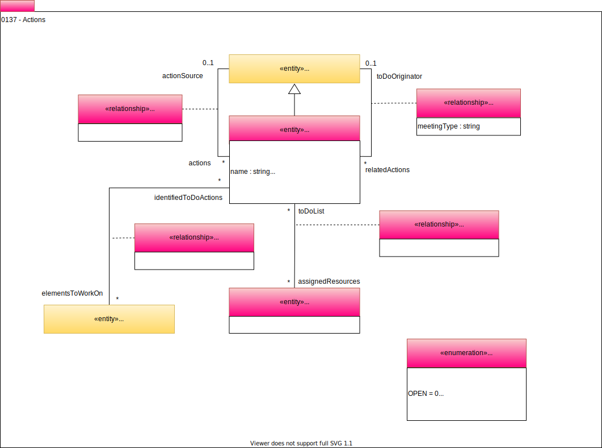

<!-- SPDX-License-Identifier: CC-BY-4.0 -->
<!-- Copyright Contributors to the Egeria project. -->

# 0137 Actions for People

In an ideal world, most governance activity is automated by the ['governanceengines'](/egeria-docs/types/4/0461-governance-engines/#governanceengines). However there are inevitably actions that require a person to do. An item of work for a person is described in a ToDo.

--8<-- "snippets/abbr.md"
