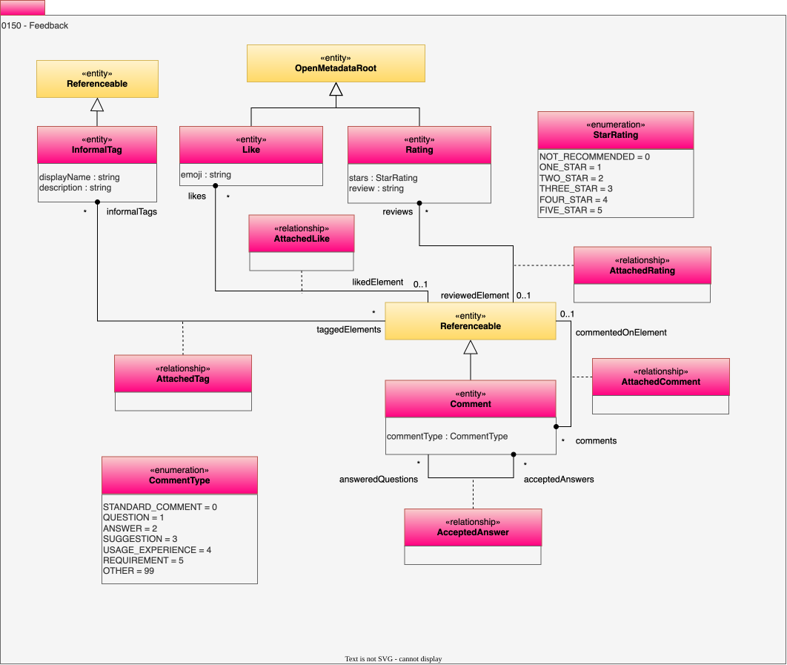

<!-- SPDX-License-Identifier: CC-BY-4.0 -->
<!-- Copyright Contributors to the Egeria project. -->

# 0150 Feedback

An important principle of good metadata it to be continually capturing the experience of subject-matter experts. The *feedback* model captures comments and ratings from subject matter experts.

Comments and ratings are a key mechanism for providing feedback on the metadata definitions by any user.  

*Note:* that because comments inherit from [Referenceable](/types/0/0010-Base-Model/#referenceable) they can be tagged, rated and commented on.

## More Information

* [More details on the different types of feedback](/concepts/feedback)

## Comment entity

Descriptive feedback or discussion related to the attached element.

* *commentType* - Defines the sequential order in which bytes are arranged into larger numerical values when stored in memory or when transmitted over digital links.

## InformalTag entity

A descriptive tag for an item.

* *displayName* - Display name of the element used for summary tables and titles.

## Like entity

Boolean type of rating expressing a favorable impression.

* *emoji* - A symbol, such as a pictogram, logogram, ideogram, or smiley embedded in text and used in electronic messages and web pages. The primary function of modern emoji is to fill in emotional cues otherwise missing from typed conversation as well as to replace words as part of a logographic system. Emoji exist in various genres, including facial expressions, expressions, activity, food and drinks, celebrations, flags, objects, symbols, places, types of weather, animals, and nature.

## Rating entity

Quantitative feedback related to an item.

* *stars* - Rating level provided.
* *review* - Additional comments associated with the rating.

## AcceptedAnswer relationship

Identifies a comment as answering a question asked in another comment.

## AttachedComment relationship

Links a comment to an item, or another comment.

## AttachedLike relationship

Links a like to an item.

## AttachedRating relationship

Links a rating to an item.

## AttachedTag relationship

Links an informal tag to an item.

--8<-- "snippets/abbr.md"
