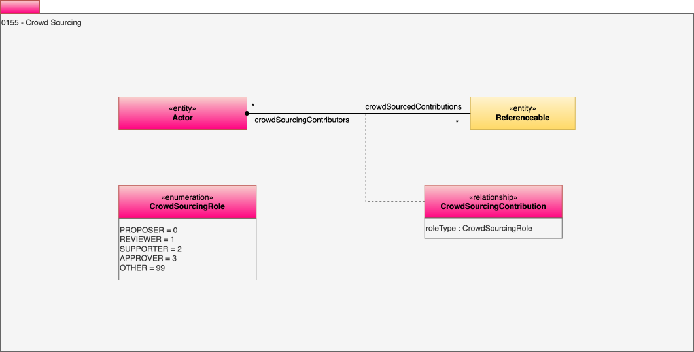

<!-- SPDX-License-Identifier: CC-BY-4.0 -->
<!-- Copyright Contributors to the Egeria project. -->

# 0155 Crowd-sourcing

Crowd-sourcing captures suggestions from consumers of assets and definitions.

## CrowdSourcingContribution relationship

Defines one of the actors contributing content to a new description or asset.

* *roleType* - Role of contributor.

--8<-- "snippets/abbr.md"
