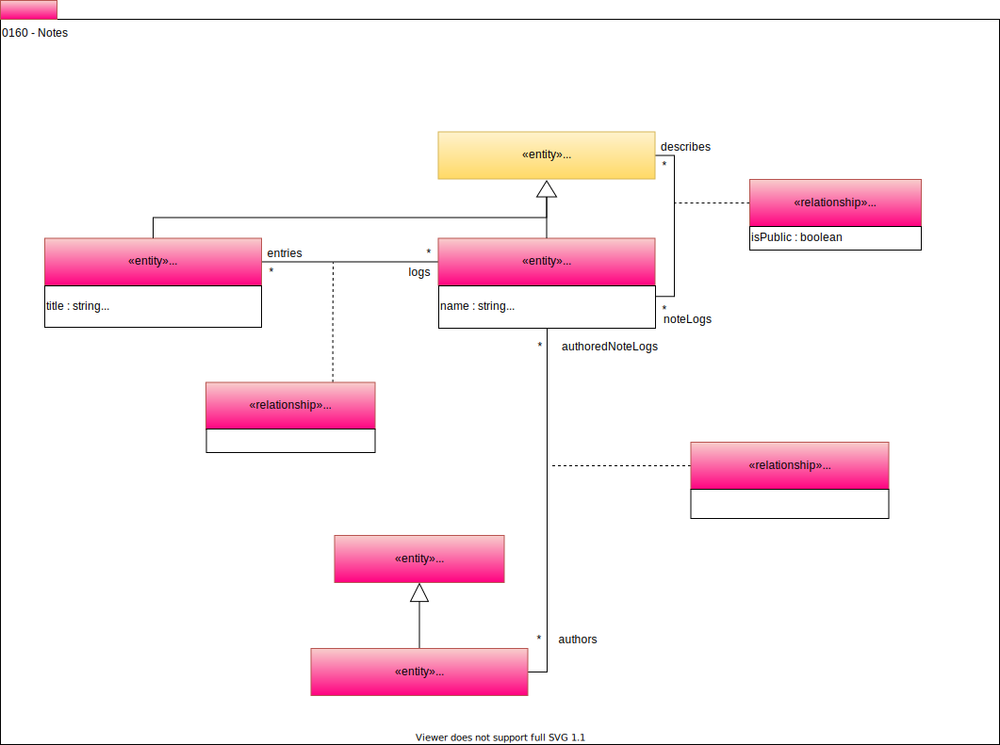

<!-- SPDX-License-Identifier: CC-BY-4.0 -->
<!-- Copyright Contributors to the Egeria project. -->

# 0160 Notes

## Notes

*Notes* provide additional information about a [Referenceable](/egeria-docs/types/0/0010-base-model/#referenceable) object. They are used by resource owners and stewards to document the current status of their resources. Engines that are performing processing on the resources may also write notes to the note log. The note log can be attached to any referenceable metadata object.

A referenceable object can have many notes linked off of it. *Notes* are used by the people with edit access to the referenceable object to provide information about its content, proposed changes and other useful information. *Notes* are also used by engines that are working on the related assets to add an informal audit trail of activity around the object.

--8<-- "snippets/abbr.md"
