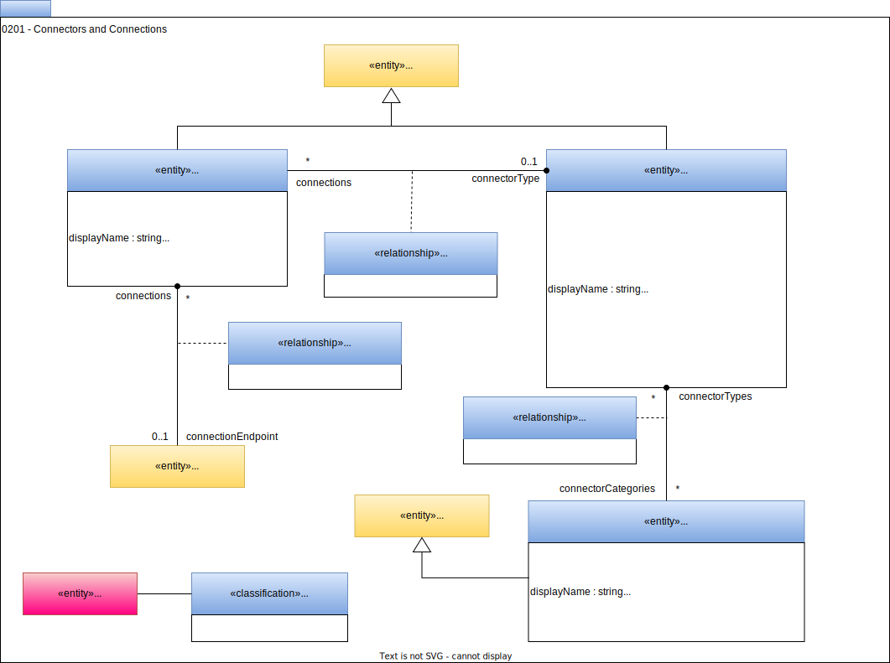

<!-- SPDX-License-Identifier: CC-BY-4.0 -->
<!-- Copyright Contributors to the ODPi Egeria project. -->

# 0201 Connectors and Connections

In [Area 0](/types/0) we introduced the definition for an [*endpoint*](/types/0/0026-Endpoints) that defined the network address of some running IT infrastructure.  The IT infrastructure could be hosting data and APIs. 

The [Open Connector Framework (OCF)](/frameworks/ocf/overview) provides client java classes called connectors to enable an application, tool or engine to call the IT Infrastructure function's through the endpoint.

## Connection entity

A *Connection* entity contains the configuration information to allow the OCF [Connector Broker](/concepts/connector-broker) to create and configure the appropriate connector instance for a client application or tool to connect to the endpoint. 

## ConnectorType entity

The *ConnectorType* defines which connector implementation should be used to connect to the endpoint. The `securedProperties` holds authentication properties such as userId and password.  They are securely stored to protect the assets. If they are missing then the security credentials of the current user are used with the connection.

By default, connector implementations are assumed to support the OCF.  However, many vendor platforms have their own connector frameworks.  The *ConnectorCategory* allows equivalent connector types from different connector frameworks to be gathered together so that the connector type from a connection can be swapped for an equivalent connector type for the locally supported connector framework.

## ConnectionConnectorType relationship

The *ConnectionConnectorType* relationship links a connection to the connector type that identified the implementation of the required connection implementation.

## ConnectToEndpoint relationship

The *ConnectToEndpoint* relationship identifies the endpoint that the connector is to connect to.

--8<-- "snippets/abbr.md"