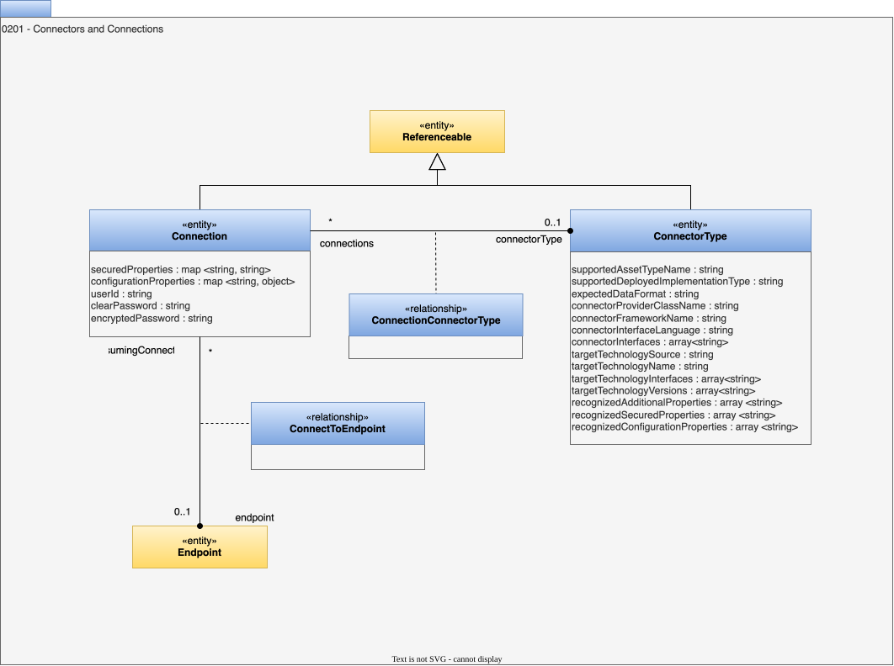

<!-- SPDX-License-Identifier: CC-BY-4.0 -->
<!-- Copyright Contributors to the ODPi Egeria project. -->

# 0201 Connectors and Connections

In [Area 0](/types/0) we introduced the definition for an [*endpoint*](/types/0/0026-Endpoints) that defined the network address of some running IT infrastructure.  The IT infrastructure could be hosting data and APIs. 

The [Open Connector Framework (OCF)](/frameworks/ocf/overview) provides client java classes called connectors to enable an application, tool or engine to call the IT Infrastructure function's through the endpoint.

## Connection entity

A *Connection* entity contains the configuration information to allow the OCF [Connector Broker](/concepts/connector-broker) to create and configure the appropriate connector instance for a client application or tool to connect to the endpoint.

* *securedProperties* - Private properties accessible only to the connector.
* *configurationProperties* - Specific configuration properties used to configure the behaviour of the connector.
* *userId* - The user identifier for the person/system executing the request.
* *clearPassword* - Password for the userId in clear text.
* *encryptedPassword* - Encrypted password that the connector needs to decrypt before use.
 

## ConnectorType entity

The *ConnectorType* defines which connector implementation should be used to connect to the endpoint. The `securedProperties` holds authentication properties such as userId and password.  They are securely stored to protect the assets. If they are missing then the security credentials of the current user are used with the connection.

* *connectorProviderClassName* - Name of the Java class that implements this connector type's open connector framework (OCF) connector provider.
* *recognizedAdditionalProperties* - List of additional connection property names supported by the connector implementation.
* *recognizedSecuredProperties* - List of secured connection property names supported by the connector implementation.
* *recognizedConfigurationProperties* - List of configuration property names supported by the connector implementation.
* *supportedAssetTypeName* - Type of asset supported by the connector implementation.
* *expectedDataFormat* - Description of the format of the data expected by the connector implementation.
* *connectorFrameworkName* - Name of the framework that the connector implements. The default is 'Open Connector Framework (OCF)'.
* *connectorInterfaceLanguage* - The programming language used to implement the connector's interface.
* *connectorInterfaces* - List of interfaces supported by the connector.
* *targetTechnologySource* - Name of the organization providing the technology that the connectors access. For example, Apache Software Foundation.
* *targetTechnologyName* - Name of the technology that the connectors access. For example, Apache Kafka.
* *targetTechnologyInterfaces* - Names of the technology's interfaces that the connectors use.
* *targetTechnologyVersions* - List of versions of the technology that the connector implementation supports.
* *supportedDeployedImplementationType* - Name of a particular type of technology. It is more specific than the open metadata types and increases the precision in which technology is catalogued. This helps human understanding and enables connectors and other actions to be targeted to the right technology.

## ConnectionConnectorType relationship

The *ConnectionConnectorType* relationship links a connection to the connector type that identified the implementation of the required connection implementation.

## ConnectToEndpoint relationship

The *ConnectToEndpoint* relationship identifies the endpoint that the connector is to connect to.

--8<-- "snippets/abbr.md"