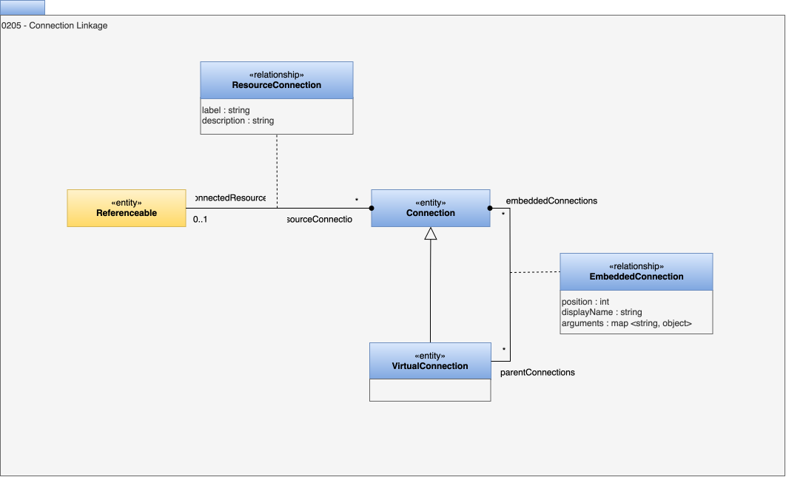

<!-- SPDX-License-Identifier: CC-BY-4.0 -->
<!-- Copyright Contributors to the ODPi Egeria project. -->

# 0205 Connection Linkage

The purpose of a [connector](/concepts/connector) is to access the content and related properties (metadata) about an [Asset](/concepts/asset) owned or used by an organization.

In order for the connector to provide details of the know properties of an Asset, the open metadata types support a relationship between a [Connection](/concepts/connection) and the Asset.

Notice that the connection can only be associated with one asset, although an Asset may support multiple connections, each providing a different class of service, or security permissions to the consumer.

In addition, some connectors are virtual connectors - by that we mean they implement an abstraction to a business level asset and internally use one of more technical connectors as part of their implementation. The metadata repository can reflect these connection relationships using a **VirtualConnection**.

## ResourceConnection relationship

The *ResourceConnection* relationship links a [Referenceable](/types/0/0010-Base-Model) to a [Connection](/types/2/0201-Connectors-and-Connections) that describes how to connect to the associated digital resource.

???+ deprecated "Deprecated types"
    The *AssetConnection* relationship is deprecated in favour of the *ResourceConnection* relationship.

## VirtualConnection entity

The *VirtualConnection* entity is used to describe a connection that has one or more other connections embedded inside it. 

## EmbeddedConnection relationship

The *EmbeddedConnection* relationship links a virtual connection to an embedded connection.

??? education "Further information"

    [Using connectors](/guides/developer/using-connectors)

* *displayName* - Display name of the element used for summary tables and titles.
* *arguments* - Additional arguments needed by the virtual connector when using each connection.
* *position* - Position of the element in a collection of relationships. Zero means no position set. A positive value identified the position starting from 1 for the first position.

    
--8<-- "snippets/abbr.md"
 