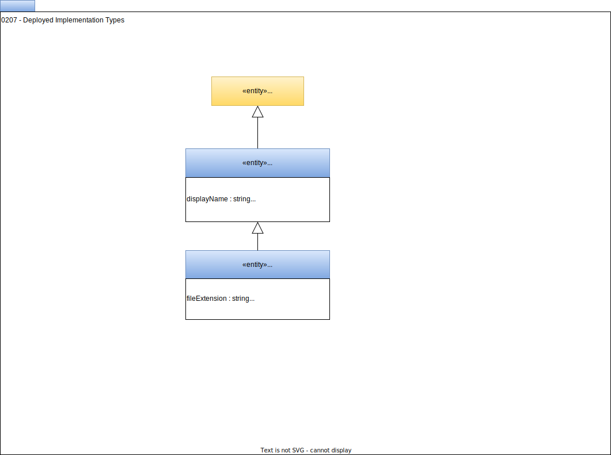

<!-- SPDX-License-Identifier: CC-BY-4.0 -->
<!-- Copyright Contributors to the ODPi Egeria project. -->

# 0207 Deployed Implementation Types

A [deployed implementation type](/concepts/deployed-implementation-type) describes a class of technology that is deployed in an organization's IT landscape.  It is represented in open metadata to allow defaults for cataloguing, management and governance to be managed for this class of technology.

## DeployedImplementationType entity

The *DeployedImplementationType* entity is a [Referenceable](/types/0/0010-Base-Model) that describes a class of technology.  Its *displayName* can be used for UI dropdown menus.  The *deployedImplementationType* property is the value to use in the property of the same name found in concrete *Asset* entities:

* [Infrastructure](/types/0/0010-Base-Model)
* [DataSet](/types/0/0010-Base-Model)
* [DataStore](/types/2/0210-Data-Stores)
* [DeployedAPI](/types/2/0212-Deployed-APIs)
* [DeployedSoftwareComponent](/types/2/0215-Software-Components)
* [DataFeed](/types/2/0223-Events-and-Logs)

In addition, *deployedImplementationType* is found in [*SoftwareServerCapability*](/types/0/0042-Software-Capabilities) entities, [*CloudPlatform*](/types/0/0090-Cloud-Platforms-and-Services) classifications and [*ServerPurpose*](/types/0/0041-Server-Purpose) classifications. 

## FileType entity

The *FileType* entity is a specialization of *DeployedImplementationType* that captures specifics about different types of files.

??? education "Further information"

    [Automated Curation OMVS](/services/omvs/automated-curation/overview)
    
--8<-- "snippets/abbr.md"
 