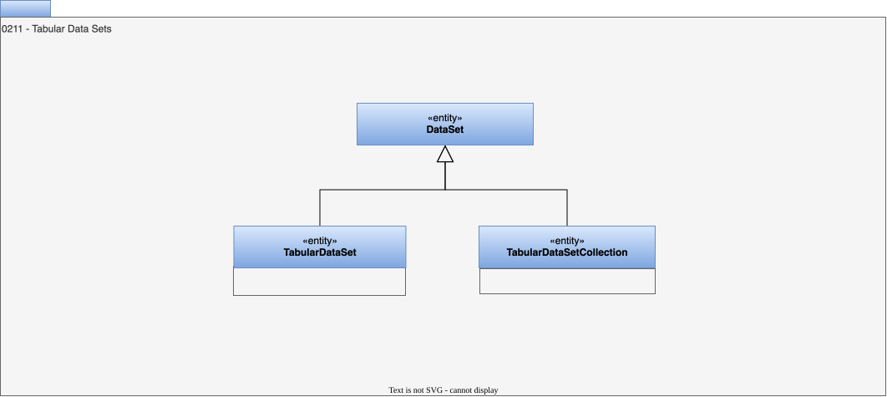

---
hide:
- toc
---

<!-- SPDX-License-Identifier: CC-BY-4.0 -->
<!-- Copyright Contributors to the ODPi Egeria project. -->

# 0211 Tabular Data Sets

# TabularDataSet entity

A data set with a tabular organization.

## TabularDataSetCollection entity

A data set containing a collection of tabular data sets.

## TabularDataSet entity

A collection of data organized as tabular data.

--8<-- "snippets/abbr.md"