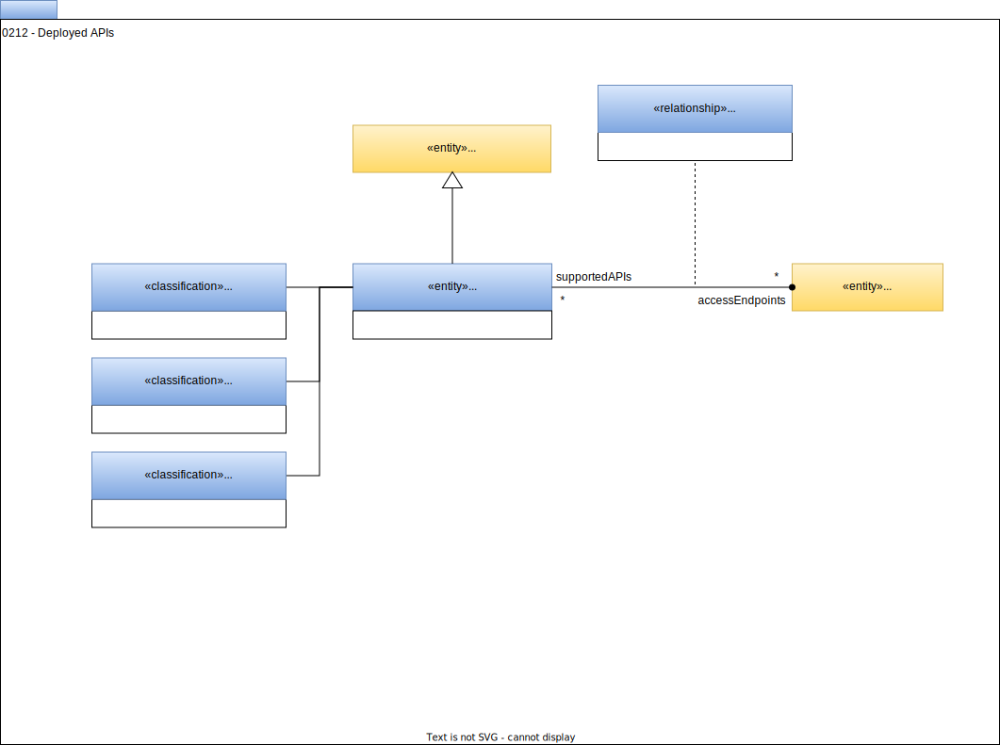

<!-- SPDX-License-Identifier: CC-BY-4.0 -->
<!-- Copyright Contributors to the ODPi Egeria project. -->

# 0212 Deployed APIs

APIs exchange data structures and commands. Each API is an access point for data and so it is important to understand and control what data is passing over an API.

 

## DeployedAPI

The *DeployedAPI* is the entity that represents the API as an [Asset](/types/0/0010-Base-Model).  The *deployedImplementationType* attribute describes the technology that is used in its implementation.  The definition of the API's operations, their parameters and responses are described via the [APISchemaType](/types/5/0536-API-Schemas) entity, which is connected to the *DeployedAPI* entity with the [AssetSchemaType](/types/5/0503-Asset-Schema) relationship.

The classifications [RequestResponseInterface](#requestresponseinterface), [ListenerInterface](#listenerinterface) and [PublisherInterface](#publisherinterface) can be used to describe the style of the API. They can appear in combination on a single *DeployedAPI*.

APIs often provide remote access to [DeployedSoftwareComponents](/types/2/0215-Software-Components).  A *DeployedAPI* entity is linked to a *DeployedSoftwareComponent* entity via the [ProcessCall](/types/7/0750-Data-Passing) relationship.

## APIEndpoint

The *APIEndPoint* relationship identifies an API deployed at a particular network address (defined in [Endpoint](/types/0/0026-Endpoints)).  THe example shown in the diagram belows shows that there are three APIs (*Product Catalog API*, *Order API* and *Shipping API*) deployed at the *OrderManagement Endpoint*.  This relationship helps the consumer understand which APIs are available through a connection.

## RequestResponseInterface

The *RequestResponseInterface* classification indicates that the API provides a synchronous call with response.

## ListenerInterface

The *ListenerInterface* classification indicates that the API registers with an event emitting asset (such as a [Topic](/types/2/0223-Events-and-Logs) or a [DataFeed](/0223-Events-and-Logs)) and processes events as they are received.

## PublisherInterface

The *PublisherInterface* classification indicates that the API provides a subscribing mechanism that another component can use to register a *ListenerInterface* in order to receive events from the API that is the *PublisherInterface*.

--8<-- "snippets/abbr.md"