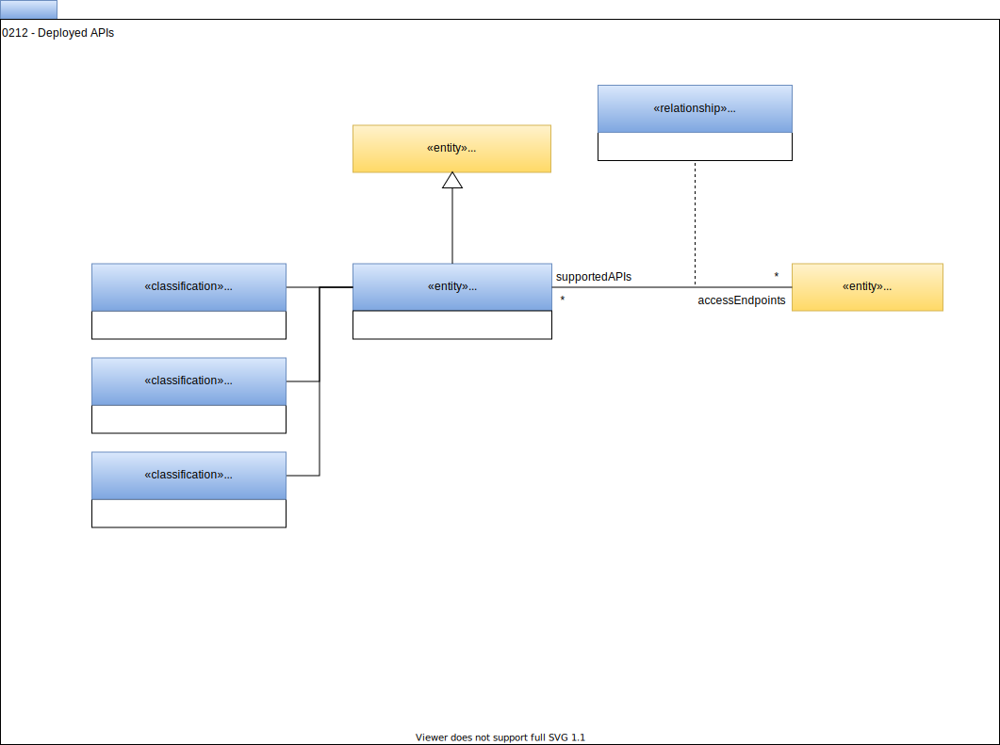

<!-- SPDX-License-Identifier: CC-BY-4.0 -->
<!-- Copyright Contributors to the Egeria project. -->

# 0212 Deployed APIs

Deployed APIs are [Assets](0010-base-model.md) that provide remote access to [DeployedSoftwareComponents](0215-software-components.md). The *APIEndPoint* identifies the network address used to call the API (defined in [Endpoint](0026-endpoints.md)).  

The classifications *RequestResponseInterface*, *ListenerInterface* and *PublisherInterface* can be used to describe the style of the API.  They can appear in combination on a single API. The structure of the API's interface is described in the [APISchema](0536-api-schemas.md).

The definition of the API's operation, parameters and responses are supported by the [API Schema Types](0536-api-schemas.md).

--8<-- "snippets/abbr.md"
