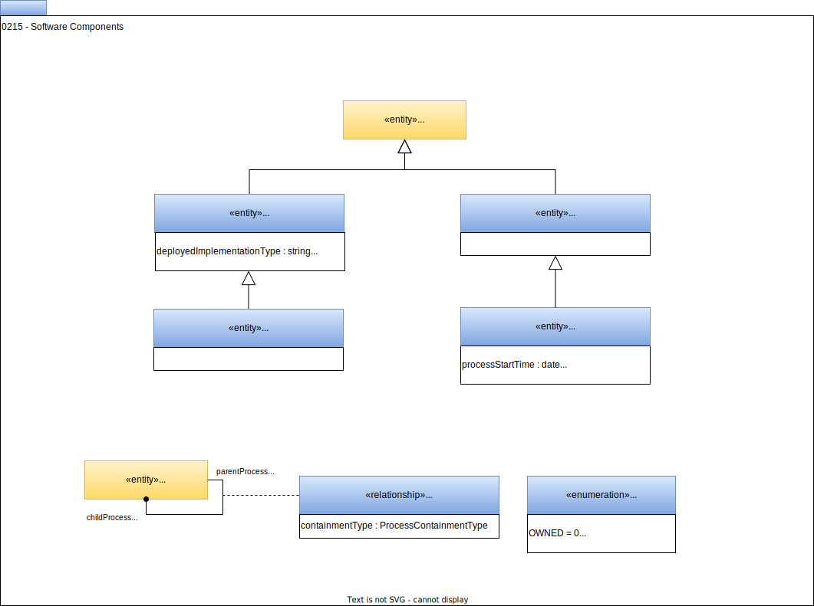

<!-- SPDX-License-Identifier: CC-BY-4.0 -->
<!-- Copyright Contributors to the ODPi Egeria project. -->

# 0215 Software Components

Many processes running in an organization's IT landscape are implemented as pluggable software components.  Some of these are simple, others are more complex.  The types shown on this page describe such components, their internal structure and running instances (if the process is short-lived and each instance has different [lineage](/features/lineage-management/overview)).

## DeployedSoftwareComponent entity

The *DeployedSoftwareComponent* entity describes a code [asset](/0/0010-Base-Model) that is deployed to implement a [software capability](/types/0/0042-Software-Capabilities). Each software component has a well defined interface describe by an [APISchema](/types/5/0536-API-Schemas) entity that is linked to the *DeployedSoftwareComponent* by the [AssetSchemaType](/types/5/0503-Asset-Schema) relationship. Its optional properties are:

* *deployedImplementationType* describes the technology used to implement the component (for example "Apache Spark").
* *implementationLanguage* describes the language used to implement the component.

## DeployedConnector entity

The *DeployedConnector* entity represents specialist software component called a [connector](/concepts/connector) that provides pluggable access to third party technologies.  These connectors implement the [Open Connector Framework (OCF)](/frameworks/ocf/overview) interfaces.   The *DeployedConnector* entity is typically linked to a [Connection](/types/2/0201-Connectors-and-Connections) entity via a [ConnectionToAsset](/types/2/0205-Connection-Linkage) relationship.

## EmbeddedProcess entity

The *EmbeddedProcess* entity describes a processing element nested within a *DeployedSoftwareComponent* entity.  Because it is transient it is possible to add the *processStartTime* and *processEndTime* properties to this entity.

## TransientEmbeddedProcess

The *TransientEmbeddedProcess* entity describes an *EmbeddedProcess* entity that runs only for a short period of time.

## ProcessHierarchy relationship

The *ProcessHierarchy* relationship defines a parent-child relationship between processes, which can be used to define more abstract processes that are comprised of lower-level processes; helping to support navigating the process hierarchy.  Typically the top if the process hierarchy inherits from *DeployedSoftwareComponent* and the nested processes inherit from *EmbeddedProcess*.

??? education "Further information"

    Related Open Metadata Type Definitions

    * [Definition of Process](/types/0/0010-Base-Model)
    * [Linking of processes into lineage graphs](/types/7)
    * [Ports to show specific input and output flows for a process](/types/2/0217-Ports)
    * [PortSchema relationships to describe the structure of data supported by a Port](/types/5/0520-Process-Schemas)

    Use of these open metadata types

    * [Egeria Developer Guide](/guides/developer) for more information on connectors and how to implement them.
    * [Lineage](/features/lineage-management/overview) describes the different types of lineage and how the open metadata types linktogether to form lineage graphs.

--8<-- "snippets/abbr.md"