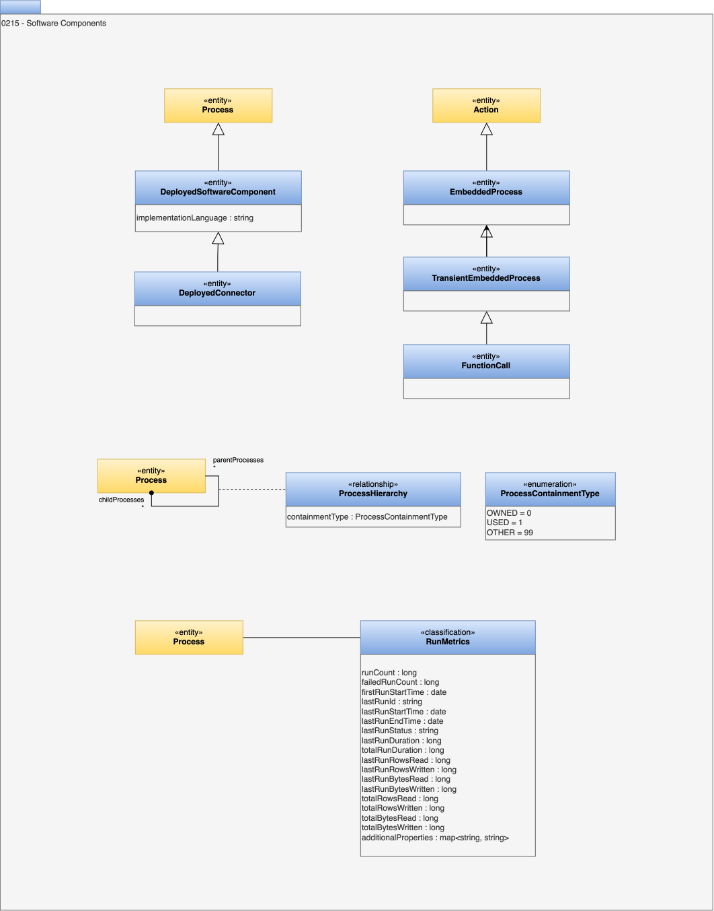

<!-- SPDX-License-Identifier: CC-BY-4.0 -->
<!-- Copyright Contributors to the ODPi Egeria project. -->

# 0215 Software Components

Many processes running in an organization's IT landscape are implemented as pluggable software components.  Some of these are simple, others are more complex.  The types shown on this page describe such components, their internal structure and running instances (if the process is short-lived and each instance has different [lineage](/features/lineage-management/overview)).

## DeployedSoftwareComponent entity

The *DeployedSoftwareComponent* entity describes a code [asset](/types/0/0010-Base-Model) that is deployed to implement a [software capability](/types/0/0042-Software-Capabilities). Each software component has a well defined interface describe by an [APISchema](/types/5/0536-API-Schemas) entity that is linked to the *DeployedSoftwareComponent* by the [Schema](/types/5/0503-Asset-Schema) relationship. Its optional properties are:

* *deployedImplementationType* describes the technology used to implement the component (for example "Apache Spark").  Values for the *deployedImplementationType* attribute can be managed for consistency in a [*deployed implementation type*](/concepts/deployed-implementation-type) valid value set.
* *implementationLanguage* describes the language used to implement the component.

## DeployedConnector entity

The *DeployedConnector* entity represents specialist software component called a [connector](/concepts/connector) that provides pluggable access to third party technologies.  These connectors implement the [Open Connector Framework (OCF)](/frameworks/ocf/overview) interfaces.   The *DeployedConnector* entity is typically linked to a [Connection](/types/2/0201-Connectors-and-Connections) entity via a [ConnectionToAsset](/types/2/0205-Connection-Linkage) relationship.

## EmbeddedProcess entity

The *EmbeddedProcess* entity describes a processing element nested within a *DeployedSoftwareComponent* entity.  Because it is transient it is possible to add the *processStartTime* and *processEndTime* properties to this entity.

## TransientEmbeddedProcess entity

The *TransientEmbeddedProcess* entity describes an *EmbeddedProcess* entity that runs only for a short period of time.

## FunctionCall entity

The *FunctionCall* entity describes a call to an external function.

## ProcessHierarchy relationship

The *ProcessHierarchy* relationship defines a parent-child relationship between processes, which can be used to define more abstract processes that are comprised of lower-level processes; helping to support navigating the process hierarchy.  Typically the top if the process hierarchy inherits from *DeployedSoftwareComponent* and the nested processes inherit from *EmbeddedProcess*.

* *containmentType* - The containment relationship between two processes: the parent and one of its children.

## RunMetrics classification

The *RunMetrics* classification records statistics about the runs of a [process](/types/0/0010-Base-Model): how many times it has run, when, for how long and how much data it handled.  It is attached to the process (typically a *DeployedSoftwareComponent*) rather than to the individual runs, so it answers questions such as "how often does this process run?" and "how much data does it process?" without needing an element for every run.  Its values are maintained as the runs are observed, for example by the [OpenLineage cataloguer](/egeria-solutions/leveraging-open-lineage/overview) as [OpenLineage](/features/lineage-management/overview) run events arrive, and refined by periodic analysis of the run history.  The attributes are:

* *runCount* - number of runs of the process that have been recorded.
* *failedRunCount* - number of recorded runs of the process that failed.
* *firstRunStartTime* - start time of the earliest recorded run of the process.
* *lastRunId* - identifier of the most recent run of the process.
* *lastRunStartTime* - start time of the most recent run of the process.
* *lastRunEndTime* - end time of the most recent run of the process.
* *lastRunStatus* - status reported for the most recent run of the process (for example START, RUNNING, COMPLETE, FAIL or ABORT).
* *lastRunDuration* - duration of the most recent completed run of the process in milliseconds.
* *totalRunDuration* - sum of the durations of the recorded completed runs of the process in milliseconds.
* *lastRunRowsRead* - number of rows (records) read by the most recent run of the process.
* *lastRunRowsWritten* - number of rows (records) written by the most recent run of the process.
* *lastRunBytesRead* - number of bytes read by the most recent run of the process.
* *lastRunBytesWritten* - number of bytes written by the most recent run of the process.
* *totalRowsRead* - sum of the rows (records) read by the recorded runs of the process.
* *totalRowsWritten* - sum of the rows (records) written by the recorded runs of the process.
* *totalBytesRead* - sum of the bytes read by the recorded runs of the process.
* *totalBytesWritten* - sum of the bytes written by the recorded runs of the process.
* *additionalProperties* - additional statistics about the runs that are not covered by the standard attributes, such as derived values from an analysis of the run history (run interval, regularity, inferred schedule, typical duration, mean data volume per run).

Together, *runCount*, *firstRunStartTime*, *lastRunStartTime* and *totalRunDuration* give the average interval between runs and the average run duration.

??? education "Further information"

    Related Open Metadata Type Definitions

    * [Definition of Process](/types/0/0010-Base-Model)
    * [Linking of processes into lineage graphs](/types/7)
    * [Ports to show specific input and output flows for a process](/types/2/0217-Ports)
    * [Schema relationships to describe the structure of data supported by a Port](/types/5/0503-Asset-Schema)

    Use of these open metadata types

    * [Egeria Developer Guide](/guides/developer) for more information on connectors and how to implement them.
    * [Lineage](/features/lineage-management/overview) describes the different types of lineage and how the open metadata types linktogether to form lineage graphs.

--8<-- "snippets/abbr.md"