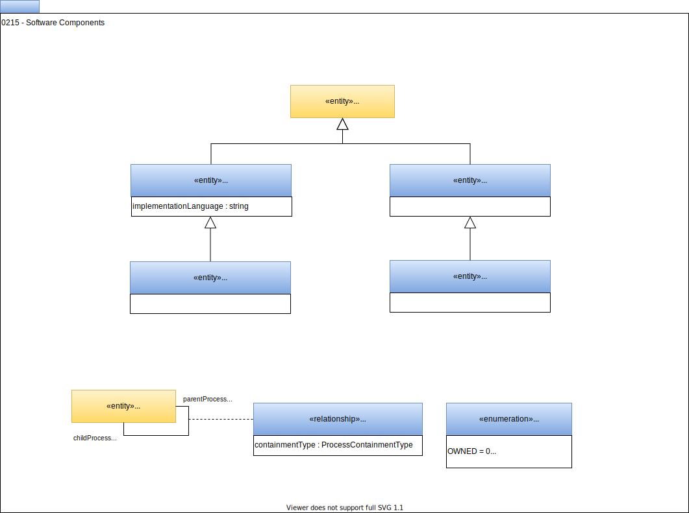

<!-- SPDX-License-Identifier: CC-BY-4.0 -->
<!-- Copyright Contributors to the Egeria project. -->

# 0215 Software Components

*DeployedSoftwareComponent* describes a code asset that is deployed to implement a [software capability](0042-software-server-capabilities.md). Each software component has a well defined interface describe by an [APISchema](0536-api-schemas.md) that is linked to the DeployedSoftwareComponent by the [AssetSchemaType](0503-asset-schema.md) relationship.

*DeployedConnector* represents specialist software component called a *connector* that provides pluggable access to third party technologies.  These connectors implement the [Open Connector Framework (OCF)](../../../open-metadata-implementation/frameworks/open-connector-framework) interfaces.

*EmbeddedProcess* describes a processing element nested within a DeployedSoftwareComponent. The *TransientEmbeddedProcess* describes an EmbeddedProcess that runs only for a short period of time.

These variations are used to provide more information for lineage graphs.

*ProcessHierarchy* defines a parent-child relationship between processes, which can be used to define more abstract processes that are comprised of lower-level processes; helping to support navigating the process hierarchy.

## More information

#### Related Open Metadata Type Definitions

- [Definition of Process](0010-base-model.md)
- [Linking of processes into lineage graphs](area-7-models.md)
- [Ports to show specific input and output flows for a process](0217-ports.md)
- [PortSchema relationships to describe the structure of data supported by a Port](0520-process-schemas.md)

#### Use of these open metadata types

- [Egeria Developer Guide](../developer-guide) for more information on connectors and how to implement them.
- [Lineage](../lineage) describes the different types of lineage and how the open metadata types link
together to form lineage graphs.

--8<-- "snippets/abbr.md"
