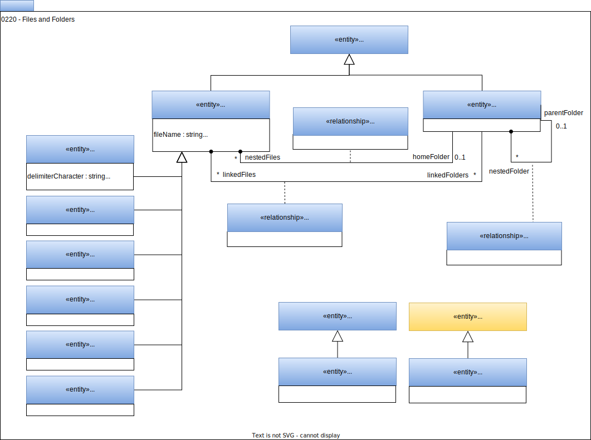

---
hide:
- toc
---

<!-- SPDX-License-Identifier: CC-BY-4.0 -->
<!-- Copyright Contributors to the ODPi Egeria project. -->

# 0220 Files and Folders

A metadata catalog typically contains information about the data files that can be processed and their location.   Files and folders describe physical files and how they are organized on the file system.

## DataFile

*DataFile* catalogs a physical file.  It inherits from [*DataStore*](/types/2/0210-Data-Stores) to declare that it is a physical artifact.  It adds the following attributes to *DataFile*:

- *pathName* - this is the fully qualified path name for the file.
- *fileName* - this is the file name for the file including file extension.
* *fileType* - this is the typical file extension for this type of file.  The values for this attribute can be managed in a valid value set.

There are subtypes for *DataFile* that identify the format of the file:

- *CSVFile* contains comma-separated values.
- *AvroFile* is organized according to the [Apache Avro](https://avro.apache.org) specification.
- *JSONFile* is encoded using [JavaScript Object Notation (JSON)](https://www.json.org/json-en.html).
- *ParquetFile* is encoded using [the Apache Parquet format](https://parquet.apache.org/).

## FileFolder

A *FileFolder* entity represents a folder or directory used to group related files together. It adds the *pathName* property which contains the fully qualified path name of the folder.

## FolderHierarchy

The *FolderHierarchy* relationship links *FileFolder* elements together to form a hierarchical organization.

## NestedFile

The *NestedFile* relationship links a file to a folder.

## LinkedFile

Files can also have a symbolic link (*LinkedFile* relationship) to an element to show that it logically belongs to the other content in the element.

## DataFolder

*DataFolder* is a special case of [*FileFolder*](#filefolder) for cataloguing directories that are contained a collection of data.  The files and nested folders within it collectively make up the data content.  They are not individually catalogued.

## Hierarchical file structures

The diagram below illustrates the structure of a file system.

The [*FileSystem*](/types/0/0056-Resource-Managers) is typically a [Software Capability](/types/0/0042-Software-Capabilities).  The root folders (of type *FileFolder*) are connected to it using the [*ServerAssetUse*](/types/0/0045-Servers-and-Assets) relationship.  Beneath that are *FileFolder* entities with *DataFile* entities nested beneath them.
 

--8<-- "snippets/abbr.md"