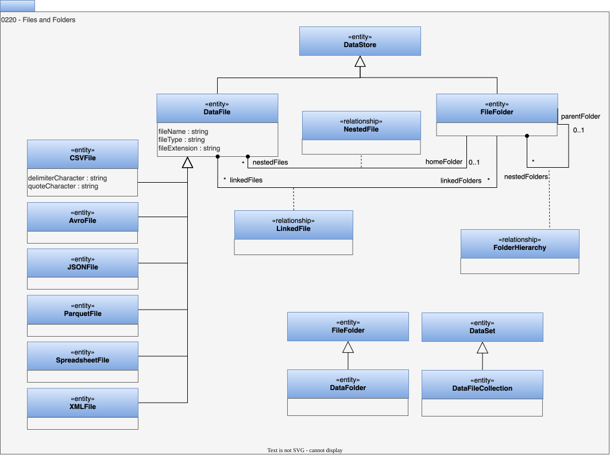
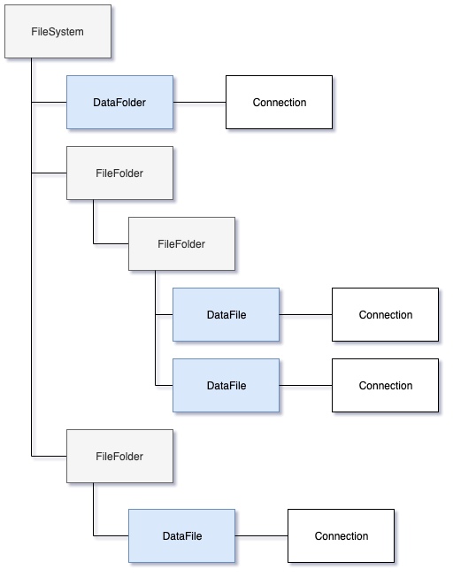

<!-- SPDX-License-Identifier: CC-BY-4.0 -->
<!-- Copyright Contributors to the ODPi Egeria project. -->

# 0220 Files and Folders

A metadata catalog typically contains information about the data files that can be processed and their location.   Files and folders describe physical files and how they are organized on the file system.

## DataFile

*DataFile* catalogs a physical file.  It inherits from [*DataStore*](/types/2/0210-Data-Stores) to declare that it is a physical artifact.  It adds the following attributes to *DataFile*:

- *pathName* - this is the fully qualified path name for the file.
- *fileName* - this is the file name for the file including file extension.
* *fileType* - this is the name of the file type.  The values for this attribute can be managed in a [file type](/concepts/deployed-implementation-type/#file-type) valid value set.
* *fileExtension* - this is the actual file extension for this file.  The values for this attribute can be managed in a valid value set.

There are subtypes for *DataFile* that identify the format of the file:

- *CSVFile* contains comma-separated values.
- *AvroFile* is organized according to the [Apache Avro](https://avro.apache.org) specification.
- *JSONFile* is encoded using [JavaScript Object Notation (JSON)](https://www.json.org/json-en.html).
- *ParquetFile* is encoded using [the Apache Parquet format](https://parquet.apache.org/).
- *SpreadsheetFile* is a file containing tabular data and formula.

## FileFolder

A *FileFolder* entity represents a folder or directory used to group related files together. It adds the *pathName* property which contains the fully qualified path name of the folder.

## FolderHierarchy

The *FolderHierarchy* relationship links *FileFolder* elements together to form a hierarchical organization.

## NestedFile

The *NestedFile* relationship links a file to a folder.

## LinkedFile

Files can also have a symbolic link (*LinkedFile* relationship) to an element to show that it logically belongs to the other content in the element.

## DataFolder

*DataFolder* is a special case of [*FileFolder*](#filefolder) for cataloguing directories that are contained a collection of data.  The files and nested folders within it collectively make up the data content.  They are not individually catalogued.

## Hierarchical file structures

The diagram below illustrates the structure of a file system.

The [*FileSystem*](/types/0/0056-Resource-Managers) is typically a [Software Capability](/types/0/0042-Software-Capabilities).  The root folders (of type *FileFolder*) are connected to it using the [*CapabilityAssetUse*](/types/0/0045-Servers-and-Assets) relationship.  Beneath that are *FileFolder* entities with *DataFile* entities nested beneath them.
 

## AvroFile entity

A description of a file that follows the Apache Avro specification.

## CSVFile entity

A file containing comma-separated (or similar delimited) data.

* *delimiterCharacter* - Character used between each column.
* *quoteCharacter* - The character used to group the content of the column that contains one or more delimiter characters.

## DataFileCollection entity

A data set that consists of a collection files (do not need to be co-located).

## JSONFile entity

A description of a file that follows the JavaScript Object Notation specification.

## ParquetFile entity

A data file which is formatted using the Apache Parquet format.

## SpreadsheetFile entity

A file containing tabular data with formula.

## XMLFile entity

A file containing an XML structure.

--8<-- "snippets/abbr.md"