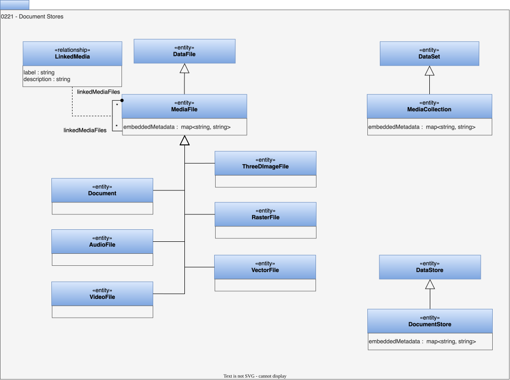

<!-- SPDX-License-Identifier: CC-BY-4.0 -->
<!-- Copyright Contributors to the ODPi Egeria project. -->

# 0221 Document Stores

Document stores describes a specialist type of server that manages documents and their metadata.

## MediaFile entity

The *MediaFile* entity describes a [*DataFile*](/types/2/0220-Files-and-Folders) that includes metadata. It is sometimes called "unstructured" data but this is a misnomer since the data within these types of files is highly structured.  *MediaFile* has the following subtypes:

* *Document* is a text-based file.  It may embed diagrams and other types of media files.
* *AudioFile* is a file containing a digitised audio recording. The different formats provide different levels of compression. Common formats include PCM (Pulse-Code Modulation), MP3 (MPEG-1 Audio Layer 3) and FLAC (Free Lossless Audio Codec).
* *VideoFile* is a file containing a video recording.  There are many different formats including MP4 (H.264), MOV and AVI.
* *3DImageFile* is a file containing 3D images.  Examples of these files are 3MF, OBJ and FBX.  This files are important in the gaming and 3D printing ecosystems.
* *RasterFile* is a file containing a picture built as a two-dimensional grid of pixels. Examples of raster files include TIFF (Tagged Image File Format), PSD (Adobe Photoshop Document), PDF (Portable Document Format), JPEG (Joint Photographics Expert Group), PNG (Portable Network Graphic), GIF (Graphics Interchange Format) and BMP (Bitmap Image File)
* *VectorFile* is a file containing a picture built from polygons - that is mathematical defined lines and curves.  It can be scaled with no loss of definition.  Common file formats for vector files are AI (Adobe Illustrator), EPS (Encapsulated PostScript), PDF (Portable Document Format), and SVG (Scalable Vector Graphics).

* *embeddedMetadata* - Metadata properties embedded in the media file.

## MediaCollection entity

A *MediaCollection* entity describes a collection of media files.  An example would be a playlist.  The collection could be manually curated or automatically curated using different criteria or algorithms.  Since *MediaCollection* inherits from [*DataSet*](/types/0/0010-Base-Model) its members are linked to using the [*DataSetContent*](/types/2/0210-Data-Stores) relationship.

??? deprecated "Deprecated types"
 * The *GroupedMedia* relationship is deprecated in favour of [*DataSetContent*](/types/2/0210-Data-Stores).

* *embeddedMetadata* - Metadata properties embedded in the media file.

## AudioFile entity

A file containing an audio recording.

## Document entity

A data file containing formatted text.

## DocumentStore entity

Identifies a data store as one that contains documents.

* *embeddedMetadata* - Metadata properties embedded in the media file.

## RasterFile entity

A file containing an image as a matrix of pixels.

## ThreeDImageFile entity

A file containing a three-dimensional image.

## VectorFile entity

A file containing an image described using mathematical formulas.

## VideoFile entity

A file containing a video recording.

## LinkedMedia relationship

Links a media file to another media file and describes relationship.

* *label* - Display label to use when displaying this lineage relationship in a lineage graph.
* *description* - Description of the element or associated resource in free-text.

--8<-- "snippets/abbr.md"