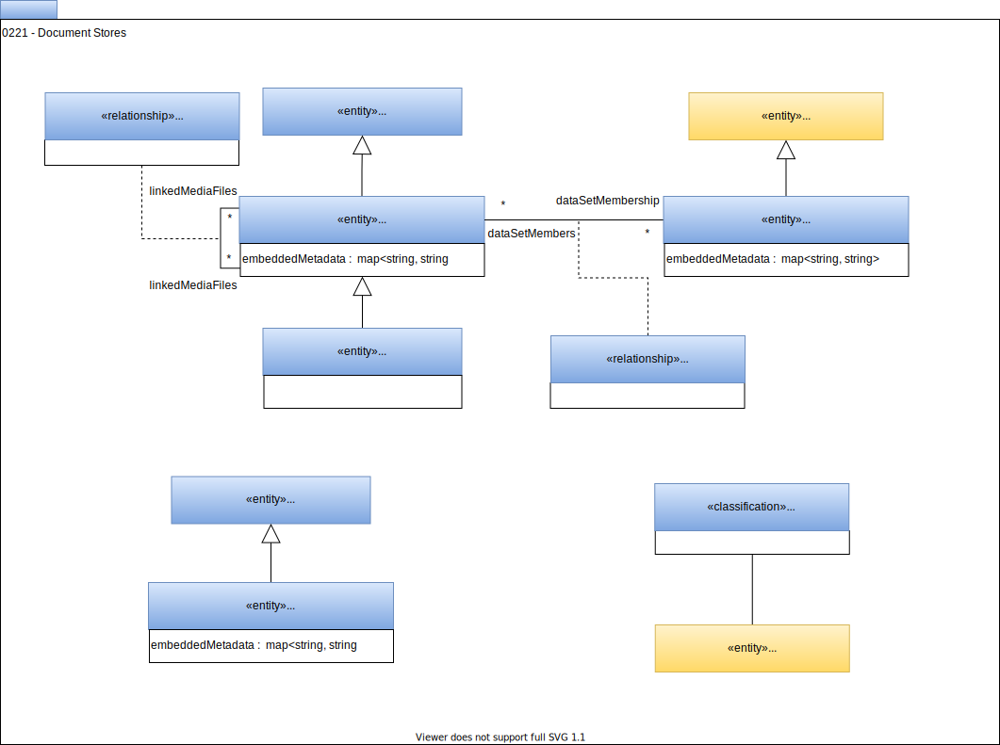

<!-- SPDX-License-Identifier: CC-BY-4.0 -->
<!-- Copyright Contributors to the Egeria project. -->

# 0221 Document Stores

Document stores describes a specialist type of server that manages documents and their metadata.

## Deprecated Types

- *ContentManager* - Use *ContentCollectionManager*

--8<-- "snippets/abbr.md"
