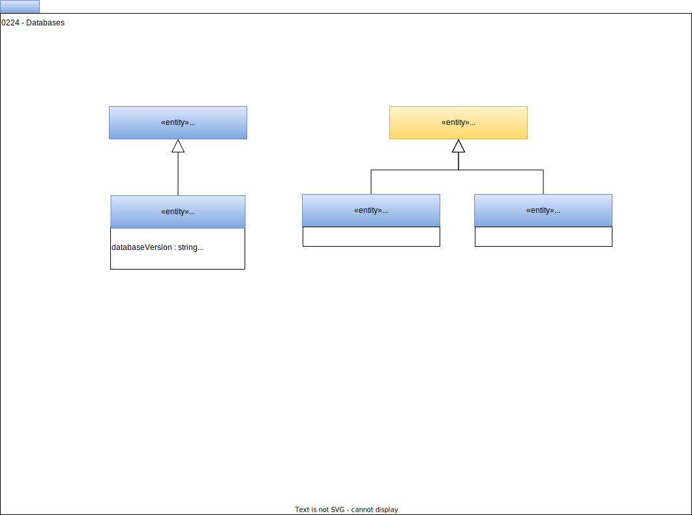

<!-- SPDX-License-Identifier: CC-BY-4.0 -->
<!-- Copyright Contributors to the ODPi Egeria project. -->

# 0224 Databases

A database is a structured store of data.  It is typically managed as a shared data source that is used by multiple applications and/or processes.

## Database entity

The *Database* entity represents the database store.  It inherits from [*DataStore*](/types/2/0210-Data-Stores) to indicate that the physical data is stored under this asset.  

## RelationalDatabase entity

The *RelationalDatabase* entity defines a database that supports the relational schema that can be accessed via the Java Database Connectivity (JDBC) interface.

## DeployedDatabaseSchema entity

Often the data within the database is organized into distinct collections of data for use by the different applications or processes.  The structure of the data in each collection is called a database schema.  Such database schemas are used to limit the scope of data that a consuming application/process is exposed to.  Where this is the case, each database schema is represented by the *DeployedDatabaseSchema* entity.  *DeployedDatabaseSchema* inherits from [*DataSet*](/types/0/0010-Base-Model) to indicate that it is a logical collection of data.  The physical data is stored in the database.

*DeployedDatabaseSchema* is linked to its *Database* using the [*DataContentForDataSet*](/types/2/0210-Data-Stores) relationship.

## TableDatabase entity

The *TableDataSet* can be used to identify an important table in a database that can be considered an asset in its own right.

!!! info "Defining the structure of data within a database"
    The structure of the data stored in a database is represented by a subclass of [*RootSchemaType*](0530-Tabular-Schemas).  For example, if the database has a relational database structure (ie tables and columns) the root schema type used is [*RelationalDBSchemaType*](/types/5/0534-Relational-Schemas).

    If the database is divided into database schemas, the structure for each database schema is described by the *RootSchemaType* which is connected to its *DeployedDatabaseSchema* entity using the [*AssetSchemaType*](/types/5/0503-Asset-Schema) relationship.

    If the database has no database schemas, the structure of the whole database is described using the *RootSchemaType* which is connected to its *Database* entity using the [*AssetSchemaType*](/types/5/0503-Asset-Schema) relationship.

--8<-- "snippets/abbr.md"