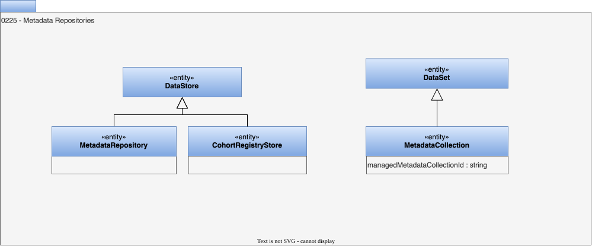

---
hide:
- toc
---

<!-- SPDX-License-Identifier: CC-BY-4.0 -->
<!-- Copyright Contributors to the ODPi Egeria project. -->

# 0225 Metadata Repositories

## CohortRegistryStore entity

A data store containing cohort membership registration details.

## MetadataCollection entity

A data set containing metadata.

* *managedMetadataCollectionId* - Unique identifier for a collection of metadata managed by a repository.

## MetadataRepository entity

A data store containing metadata.

--8<-- "snippets/abbr.md"