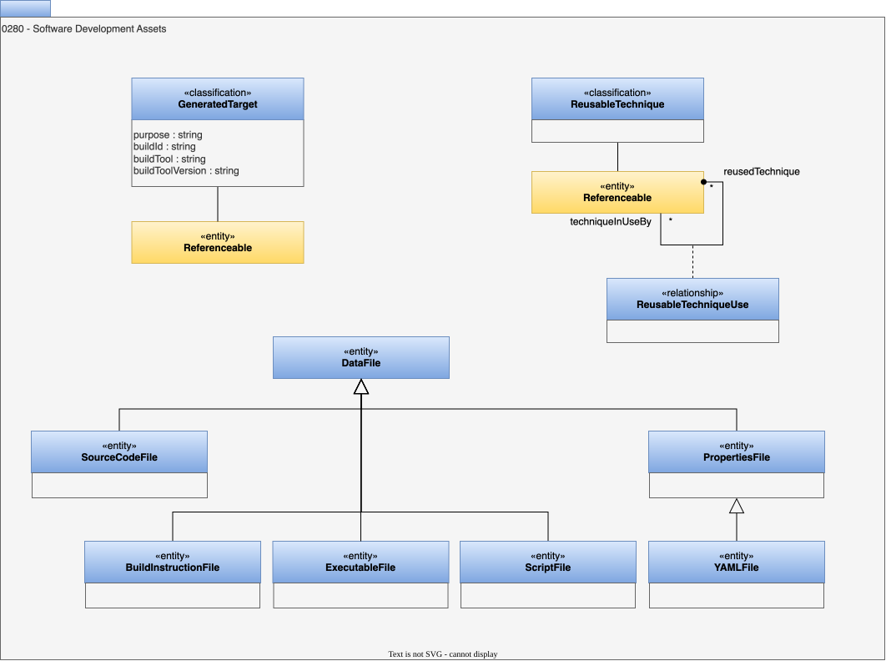

<!-- SPDX-License-Identifier: CC-BY-4.0 -->
<!-- Copyright Contributors to the ODPi Egeria project. -->

# 0280 Software Development Assets

## BuildInstructionFile entity

A file containing instructions to run a build of a software artifact or system.

## GeneratedTarget classification

The [element](/types/0/0010-Base-Model) that is the generated output from a build program or script.  It means it can be reproduced at will and does not need backing up.  This is different from software generated by a non-deterministic process, such as an LLM-based code generator which may not create the same results twice.  It has the following attributes:

* *purpose* - the purpose of the target.
* *buildId* - the identifier of the build process that created the target.
* *buildTool* - the name of the build tool that created the target.
* *buildToolVersion* - the version of the build tool that created the target.

## ExecutableFile entity

A file containing compiled code that can be executed.

## PropertiesFile entity

A file containing a list of properties, typically used for configuration of some software.

## ScriptFile entity

A file containing code that is interpreted when it is run.

## SourceCodeFile entity

A text file containing a program written in a language that needs to be complied into an executable form before it can run.

## YAMLFile entity

A file containing properties in YAML format. This it typically used for configuration.

## ReusableTechnique classification

The *ReusableTechnique* classification identifies a process, script or technique that can be reused in multiple contexts.  It is a collection of steps that can be executed to achieve a specific goal.

## ReusableTechniqueUse relationship

The *ReusableTechniqueUse* relationship identifies where a reusable technique has been used.

--8<-- "snippets/abbr.md"