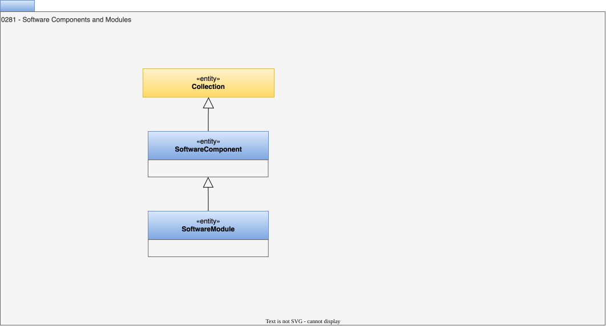

<!-- SPDX-License-Identifier: CC-BY-4.0 -->
<!-- Copyright Contributors to the ODPi Egeria project. -->

# 0281 Software Components and Modules

## SoftwareComponent entity

A *SoftwareComponent* entity is a [collection](/types/0/0021-Collections) of artifacts that together can be used to create a useful, and potentially reusable runnable software component.  Software components typically have well defined interfaces that can be used to combine software components together to create a new software component.

## SoftwareModule entity

A *SoftwareModule* entity is a [collection](/types/0/0021-Collections) of software components that together can be used to create a useful, and potentially reusable software component.  This is why the SoftwareModule type inherits from the SoftwareComponent type.

--8<-- "snippets/abbr.md"