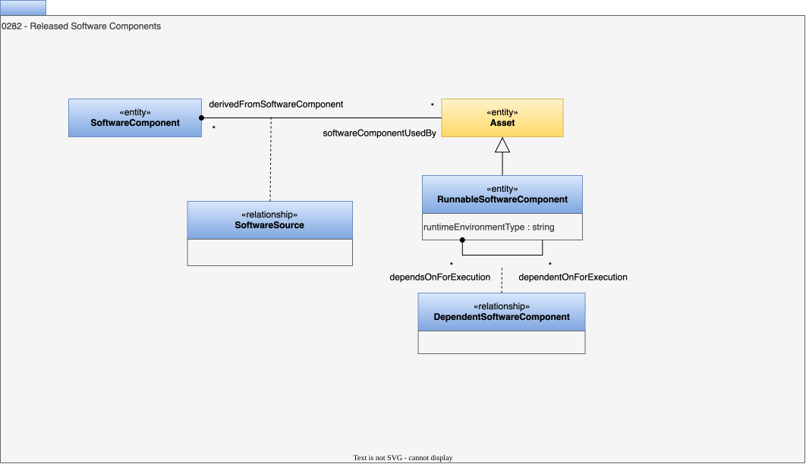

<!-- SPDX-License-Identifier: CC-BY-4.0 -->
<!-- Copyright Contributors to the ODPi Egeria project. -->

# 0282 Released Software Components

## RunnableSoftwareComponent entity

The *RunnableSoftwareComponent* entity describes a software component that is released and available for use.  It is executable but may have external dependencies that require additional assets to be available before it will execute successfully.  The version of the release is recorded in *versionIdentifier*, which it inherits from [Referenceable](/types/0/0010-Base-Model).  It has the following attribute:

* *runtimeEnvironmentType* - the type of runtime environment needed to execute this software component.

## DependentSoftwareComponent relationship

The *DependentSoftwareComponent* relationship describes the dependency relationship between runnable software components.

## SoftwareSource relationship

The *SoftwareSource* relationship describes the relationship between a software component and the software asset that derives from it.

--8<-- "snippets/abbr.md"