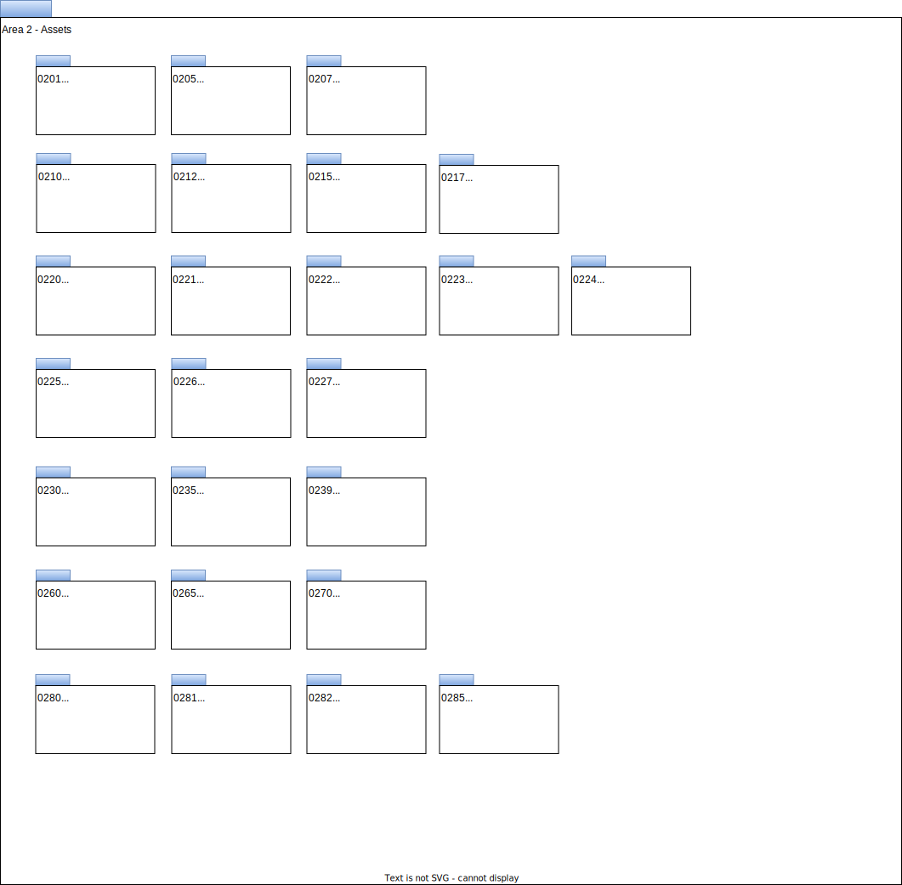

---
hide:
- toc
---

<!-- SPDX-License-Identifier: CC-BY-4.0 -->
<!-- Copyright Contributors to the Egeria project. -->

# Area 2 Models - Assets

Area 2 of the open metadata model covers the basic types of asset that need to be governed in order to make best use of them. It builds out the core types of assets, extending from Asset, Infrastructure, DataSet and Process defined in the [0010 Base Model](0010-base-model.md).

This includes the data sources, APIs, analytics models, transformation functions and rule implementations that store and manage data.

The definitions in Area 2 also include connectivity information that is used by the [Open Connector Framework (OCF)](../../../open-metadata-implementation/frameworks/open-connector-framework/README.md) (and other tools) to get access to the data assets.

- [0201 Connectors and Connections](0201-connectors-and-connections.md)
- [0205 Connection Linkage](0205-connection-linkage.md)
- [0210 Data Stores](0210-data-stores.md)
- [0211 Data Sets](0211-data-sets.md)
- [0212 Deployed APIs](0212-deployed-apis.md)
- [0215 Software Components](0215-software-components.md)
- [0217 Ports](0217-ports.md)
- [0220 Files and Folders](0220-files-and-folders.md)
- [0221 Document Stores](0221-document-stores.md)
- [0222 Graph Stores](0222-graph-stores.md)
- [0223 Event Stores and Logs](0223-events-and-logs.md)
- [0224 Databases](0224-databases.md)
- [0225 Metadata Repositories](0225-metadata-repositories.md)
- [0227 Keystores](0227-keystores.md)
- [0230 Code Tables](0230-code-tables.md)
- [0235 Information View](0235-information-view.md)
- [0239 Reports](0239-reports.md)
- [0265 Analytics Assets](0265-analytics-assets.md)
- [0280 Software Development Assets](0280-software-development-assets.md)
- [0281 Software Modules](0281-software-modules.md)
- [0282 Released Software Components](0282-released-software-components.md)
- [0285 Analytics Development Assets](0285-analytics-development-assets.md)

--8<-- "snippets/abbr.md"
