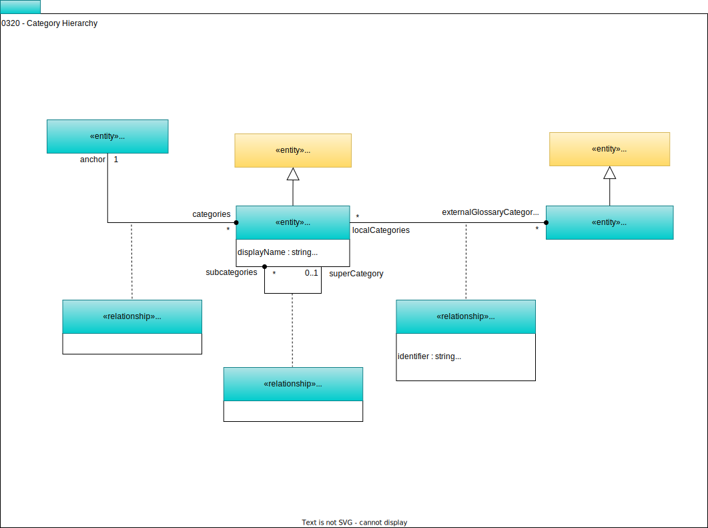

<!-- SPDX-License-Identifier: CC-BY-4.0 -->
<!-- Copyright Contributors to the ODPi Egeria project. -->

# 0320 Category Hierarchy

The vocabulary for a [Glossary](/types/3/0310-Glossary) may be organized into a hierarchy of categories. These categories effectively provide a folder structure for the glossary.

## GlossaryCategory entity

*GlossaryCategory* represents a category in a glossary.

## CategoryAnchor relationship

The *CategoryAnchor* relationship identifies the glossary that owns the category. This means that this is its anchor glossary. If the Glossary object is deleted then so are all the categories linked to it.

## CategoryHierarchyLink relationship

*CategoryHierarchyLink* is a relationship used to organize categories into a hierarchy to, for example, create a structure for a [taxonomy](/types/3/0310-Glossary). A category may have none or one super-category. However, this super-category may be in a different glossary.

## RootCategory classification

*RootCategory* identifies a category as one of the top-level categories in a glossary.

## LibraryCategoryReference relationship

*LibraryCategoryReference* provides reference information for how this category corresponds to a category in an external glossary.

!!! info "Further information"
    * [*SubjectArea*](/type/4/0425-Subject-Areas) is a classification for a category that indicates that the category represents a subject area.
    * The members of a category are [*GlossaryTerms*](/type/3/0330-Terms).
    * A glossary term may be a member of multiple categories.  However, the [*PrimaryCategory*](/types/3/0335-Primary-Category) classification on a glossary term indicates which category is its primary category.

--8<-- "snippets/abbr.md"