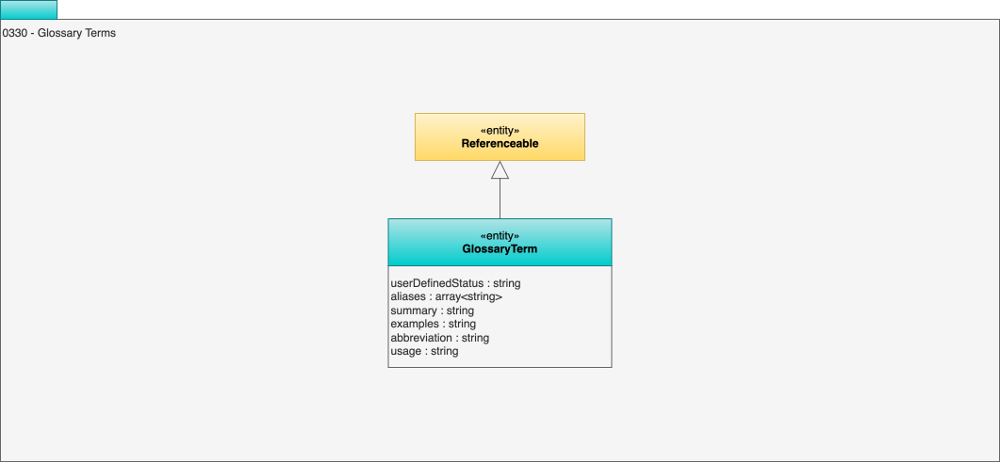

<!-- SPDX-License-Identifier: CC-BY-4.0 -->
<!-- Copyright Contributors to the ODPi Egeria project. -->

# 0330 Terms

The vocabulary for a [glossary](/types/3/0310-Glossary) is documented using [glossary terms](/concepts/glossary-term). Each term represents a concept or short phrase in the vocabulary.  

Model 0330 shows the attributes of a glossary term.

## GlossaryTerm entity

The *GlossaryTerm* entity represents a term in a glossary. It is an [AuthoredReferenceable](/types/0/0010-Base-Model) which includes the *contentStatus* attribute allowing the term to move through a series of states while it is being edited and reviewed.

In addition to the attributes inherited from [AuthoredReferenceable](/types/0/0010-Base-Model), it adds the following attributes:

* *aliases* - a list of synonyms for the term.
* *summary* - a short description of the term's meaning.
* *examples* - a list of examples of the term being used.
* *abbreviation* - a shortened form of the term.
* *usage* - a description of how the term is used in the business.

--8<-- "snippets/abbr.md"