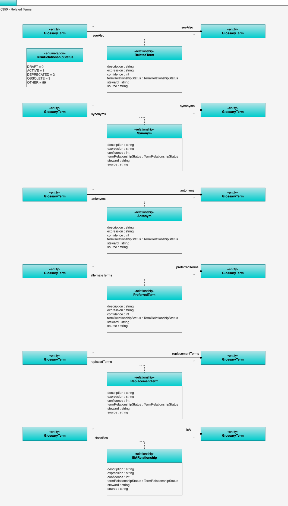

<!-- SPDX-License-Identifier: CC-BY-4.0 -->
<!-- Copyright Contributors to the ODPi Egeria project. -->

# 0350 Related Terms

The Related Terms model contains relationships used to show how the assets of different terms are related to one another.

## TermRelationshipStatus enumeration

The *TermRelationshipStatus* enum defines how reliable the relationship is between two glossary terms:

* DRAFT means the relationship is under development.
* ACTIVE means the relationship is validated and in use.
* DEPRECATED means the relationship is being phased out.
* OBSOLETE means that the relationship should not be used anymore.
* OTHER means that the status is not one of the statuses listed above.  The description field can be used to add more details.

## Relationships

The related term relationships are as follows:

* **RelatedTerm** is a relationship used to say that the linked glossary term may also be of interest.
It is like a "see also" link in a dictionary.
The description field can be used to explain why the linked term is of interest.
* [**Synonym**](#synonym-relationship) is a relationship between glossary terms that have the same, or a very similar meaning.
* [**Antonym**](#antonym-relationship) is a relationship between glossary terms that have the opposite (or near opposite) meaning.
* [**PreferredTerm**](#preferredterm-relationship) is a relationship that indicates that the preferredTerm should be used in place of the preferredToTerm. 
* [**ReplacementTerm**](#replacementterm-relationship) is a relationship that indicates that the replacementTerm must be used instead of the replacedByTerm.
This is stronger version of the PreferredTerm.
* [**IsA**](#isa-relationship) is a relationship that defines that the "isA" term is a more generic term than the "isOf" term.
For example, this relationship would be use to say that "Cat" ISA "Animal".

## Antonym relationship

Link between glossary terms that have the opposite meaning.

* *description* - Description of the element or associated resource in free-text.
* *expression* - Expression used to create the annotation.
* *confidence* - Level of confidence in the correctness of the element. 0=unknown; 1=low confidence; 100=total confidence.
* *steward* - Unique identifier for the steward performing the action.
* *source* - Details of the organization, person or process that created the element, or provided the information used to create the element.
* *termRelationshipStatus* - Defines the confidence in the assigned relationship.

## ISARelationship relationship

Link between a more general glossary term and a more specific definition.

* *description* - Description of the element or associated resource in free-text.
* *expression* - Expression used to create the annotation.
* *confidence* - Level of confidence in the correctness of the element. 0=unknown; 1=low confidence; 100=total confidence.
* *steward* - Unique identifier for the steward performing the action.
* *source* - Details of the organization, person or process that created the element, or provided the information used to create the element.
* *termRelationshipStatus* - Defines the confidence in the assigned relationship.

## PreferredTerm relationship

Link to an alternative term that the organization prefers to use.

* *description* - Description of the element or associated resource in free-text.
* *expression* - Expression used to create the annotation.
* *confidence* - Level of confidence in the correctness of the element. 0=unknown; 1=low confidence; 100=total confidence.
* *steward* - Unique identifier for the steward performing the action.
* *source* - Details of the organization, person or process that created the element, or provided the information used to create the element.
* *termRelationshipStatus* - Defines the confidence in the assigned relationship.

## RelatedTerm relationship

Link between similar glossary terms.

* *description* - Description of the element or associated resource in free-text.
* *expression* - Expression used to create the annotation.
* *confidence* - Level of confidence in the correctness of the element. 0=unknown; 1=low confidence; 100=total confidence.
* *steward* - Unique identifier for the steward performing the action.
* *source* - Details of the organization, person or process that created the element, or provided the information used to create the element.
* *termRelationshipStatus* - Defines the confidence in the assigned relationship.

## ReplacementTerm relationship

Link to a glossary term that is replacing an obsolete glossary term.

* *description* - Description of the element or associated resource in free-text.
* *expression* - Expression used to create the annotation.
* *confidence* - Level of confidence in the correctness of the element. 0=unknown; 1=low confidence; 100=total confidence.
* *steward* - Unique identifier for the steward performing the action.
* *source* - Details of the organization, person or process that created the element, or provided the information used to create the element.
* *termRelationshipStatus* - Defines the confidence in the assigned relationship.

## Synonym relationship

Link between glossary terms that have the same meaning.

* *description* - Description of the element or associated resource in free-text.
* *expression* - Expression used to create the annotation.
* *confidence* - Level of confidence in the correctness of the element. 0=unknown; 1=low confidence; 100=total confidence.
* *steward* - Unique identifier for the steward performing the action.
* *source* - Details of the organization, person or process that created the element, or provided the information used to create the element.
* *termRelationshipStatus* - Defines the confidence in the assigned relationship.

--8<-- "snippets/abbr.md"