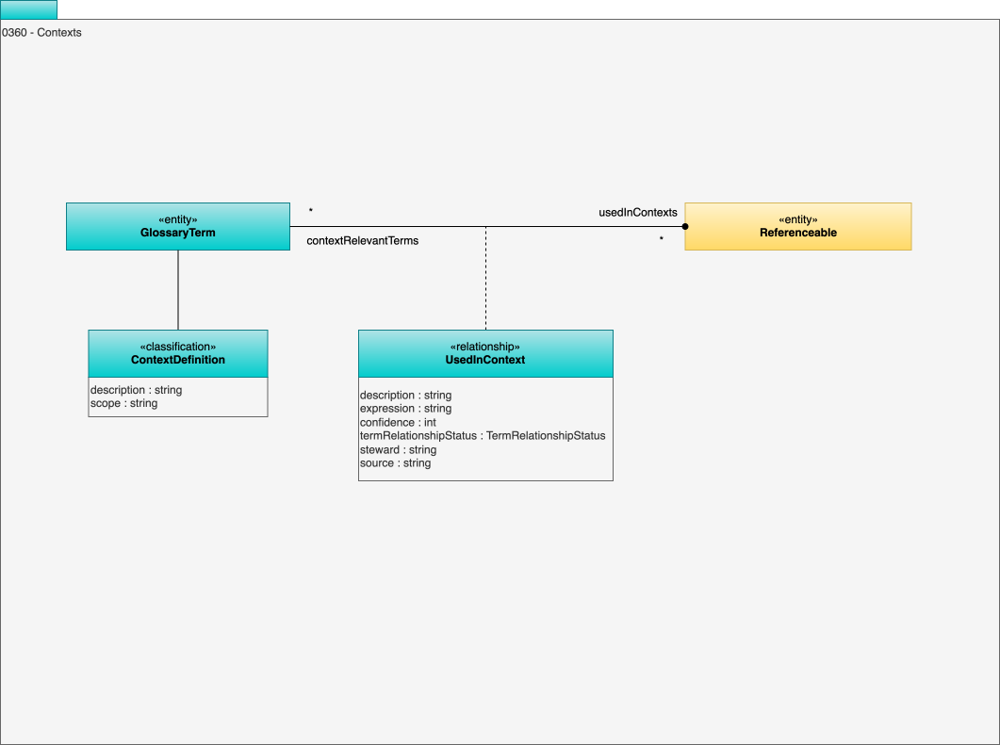

---
hide:
- toc
---

<!-- SPDX-License-Identifier: CC-BY-4.0 -->
<!-- Copyright Contributors to the ODPi Egeria project. -->

# 0360 Contexts

The Context model defines a classification for a
glossary term that indicates it defines a context,
and a relationship called **UsedInContext** to link terms that are relevant in that context.

The **ContextDefinition** classification indicates that the term describes a context.
    
Glossary Terms that are relevant in that context are linked to the context definition term using the *UsedInContext* relationship.

## UsedInContext relationship

Link between glossary terms where on describes the context where the other one is valid to use.

* *description* - Description of the element or associated resource in free-text.
* *expression* - Expression used to create the annotation.
* *confidence* - Level of confidence in the correctness of the element. 0=unknown; 1=low confidence; 100=total confidence.
* *steward* - Unique identifier for the steward performing the action.
* *source* - Details of the organization, person or process that created the element, or provided the information used to create the element.
* *termRelationshipStatus* - Defines the confidence in the assigned relationship.

## ContextDefinition classification

Identifies a glossary term that describes a context where processing or decisions occur.

* *description* - Description of the element or associated resource in free-text.
* *scope* - Breadth of responsibility or coverage.

--8<-- "snippets/abbr.md"