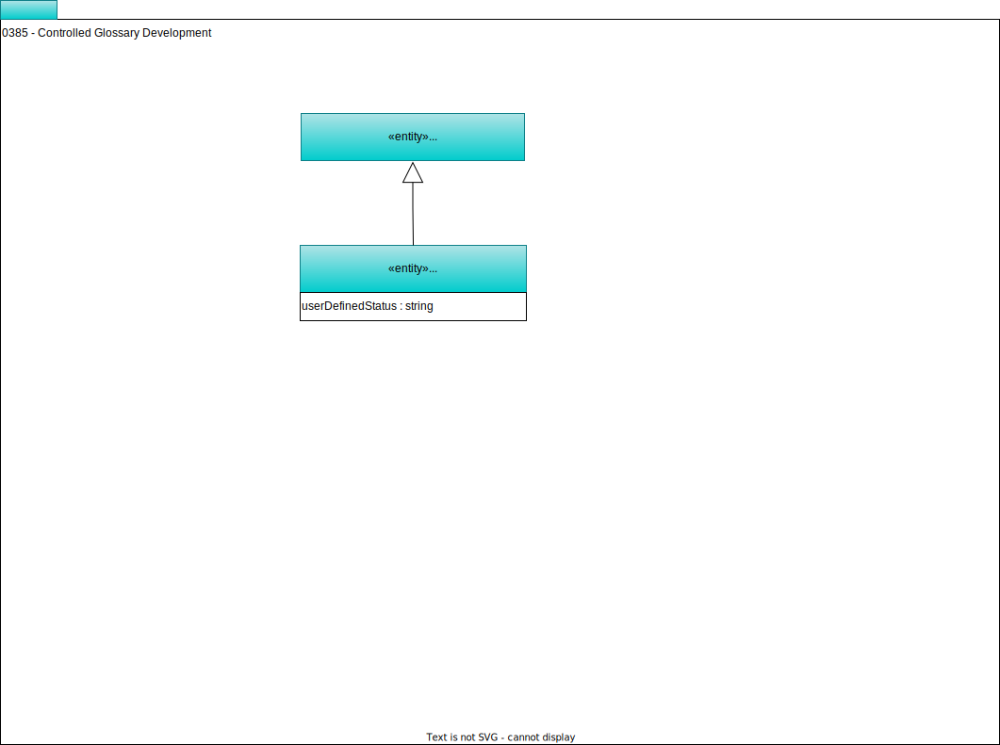

<!-- SPDX-License-Identifier: CC-BY-4.0 -->
<!-- Copyright Contributors to the ODPi Egeria project. -->

# 0385 Controlled Glossary Development

Many organization that use glossary terms to drive the operation of the data landscape need to use a controlled process to introduce and amend glossary terms, because the consequences of any change need to be carefully considered.  This model covers the extensions needed to support a controlled development process for glossary terms.

## ControlledGlossaryTerm entity

The *ControlledGlossaryTerm* extends the standard [GlossaryTerm](/types/3/0330-Terms) with additional valid [instance statuses](/concepts/instance-status) for supporting a complex development lifecycle.  The statuses are:

* Draft      - The term is incomplete. 
* Prepared   - The term is ready for review.
* Proposed   - The term is in review.
* Approved   - The term is approved and awaiting activation.
* Rejected   - The term is rejected and should not be used.
* Active     - The term is approved and in use.
* Deprecated - The term is out of date and should not be used.
* Other      - The term is in a locally defined state.
* Deleted    - The term has been soft-deleted and can no longer be used.

These status values can be thought of as the system-defined statuses.  It is possible to replace, or extend these statuses using the `userDefinedStatus` attribute that can be controlled through the use of [valid metadata values](/guises/planning/valid-metadta-values/overview).

--8<-- "snippets/abbr.md"