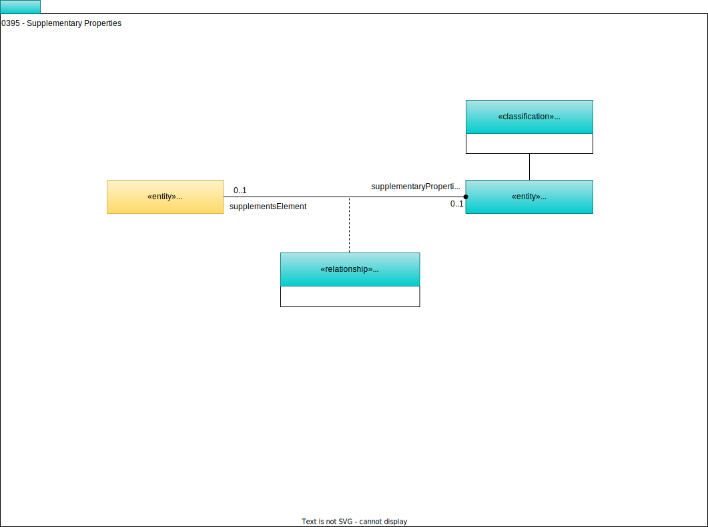

---
hide:
- toc
---

<!-- SPDX-License-Identifier: CC-BY-4.0 -->
<!-- Copyright Contributors to the ODPi Egeria project. -->

# 0395 Supplementary Properties

The *SupplementaryProperties* link a [Referenceable](/types/0/0010-Base-Model) element
to a glossary term that contains additional descriptive properties about the linked element.
This enables a steward or owner to maintain additional information about the element
event if the element is read-only because it is technical metadata extracted from an engine or platform.

The [Asset Manager OMAS](/services/omas/asset-manager/overview) makes use of this relationship to link an asset to a glossary term that is providing supplementary properties to the asset.

--8<-- "snippets/abbr.md"