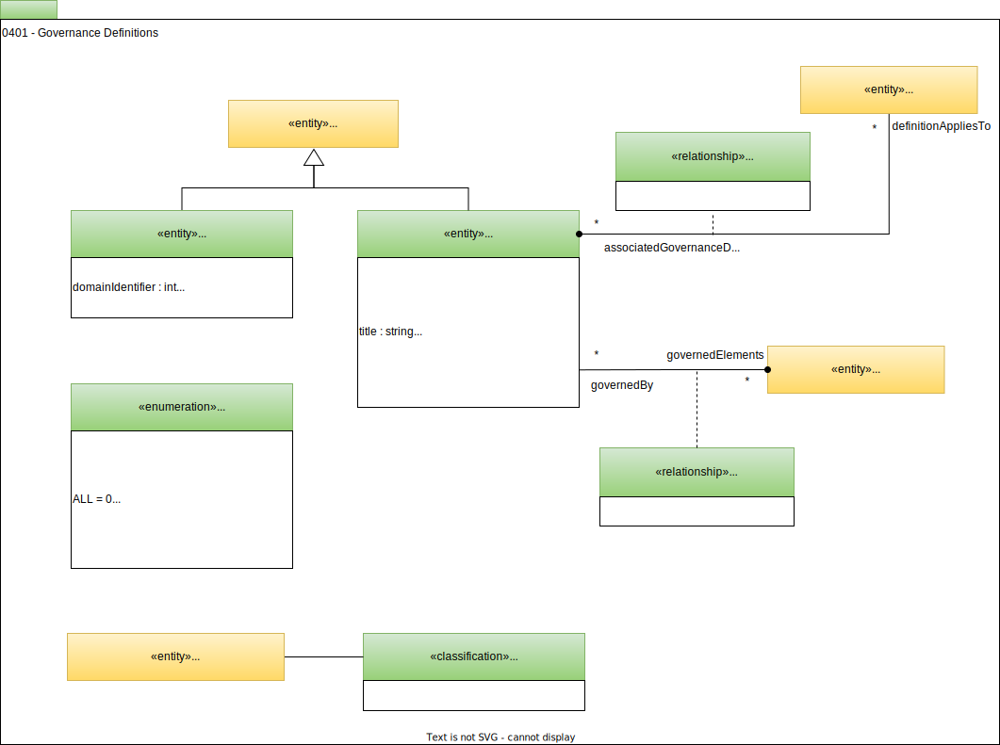

---
hide:
- toc
---

<!-- SPDX-License-Identifier: CC-BY-4.0 -->
<!-- Copyright Contributors to the ODPi Egeria project. -->

# 0401 Governance Definitions

The world of governance is divided into different governance domains that focus on a specific set of assets or activities.
Egeria aims to unify the metadata and governance activity across these governance domains.

*GovernanceDomain* provides a default list of the different types of governance domains that can be unified by Egeria. Notice that there are obvious overlaps and linkages between the domains:

* DATA - the governance of data and its use.
* PRIVACY - the support for data privacy.
* SECURITY - the governance that ensures IT systems and the data they hold are secure.
* IT_INFRASTRUCTURE - the governance of the configuration and management of IT infrastructure and the software that runs on it.
* SOFTWARE_DEVELOPMENT - the governance of the software development lifecycle.
* CORPORATE - the governance of the organization as a legal entity.
* ASSET_MANAGEMENT - the governance of physical assets.

The *GovernanceDomainDescription* provides the definition of a governance domain. You can choose to define your own or use the standard set that are defined by *GovernanceDomain*.  Related governance domains can be grouped into *GovernanceDomainSets*.

The role of leader of a governance domain is represented as a [*GovernanceOfficer*](/types/4/0445-Governance-Roles).

*GovernanceDefinition* describes an aspect of a governance program. They are authored in the metadata repository. They inherit from [Referenceable](/types/0/0010-Base-Model), which means they have a unique identifier and link to external references for more information.

*GovernedBy* links the governance definitions to the elements they are governing.  *GovernanceDefinitionScope* links the governance definitions to the elements (organizations, projects, teams, ...) that are using the governance definition.

The governance definitions are organized into specific subtypes and linked together to provide a complete description of the governance program.  The types for these more specialized definitions can be found on the following pages:
  
  - [0405 Governance Drivers](/types/4/0405-Governance-Drivers) - describe the motivations behind the governance program.
  - [0415 Governance Responses](/types/4/0415-Governance-Responses) - describe the policies that support each of the drivers.
  - [0420 Governance Controls](/types/4/0420-Governance-Controls) - describe how the policies will be implemented.
     * [0430 Technical Controls](/types/4/0430-Technical-Controls) - describe automated behaviour that implements a governance control.
    
        - [0423 Security Groups](/types/4/0423-Security-Definitions) - define security groups and the assets and roles associated with them.
        - [0438 Naming Standards](/types/4/0438-Naming-Standards) - defines naming standard rules.
        - [0461 Governance Action Engines](/types/4/0461-Governance-Engines) - support the execution of technical controls.
        - [0462 Governance Action Types](0462-Governance-Action-Types.md) - provide the choreography of the execution of technical controls.
       
     * [0440 Organizational Controls](0440-Organizational-Controls.md) - identity governance roles and manual procedures (such as approvals) that implement a governance control.
    
        - [0445 Governance Roles](0445-Governance-Roles.md) - define governance responsibilities, roles and the people associated with them.
       
  - [0481 License Types](0481-Licenses.md) - terms and conditions used in rights management.
  - [0482 Certification Types](0482-Certifications.md) - types of certifications used to shw compliance to a specific governance requirement.
  - [0485 Data Processing Purposes](0485-Data-Processing-Purposes.md) - definitions of purposes used in data privacy regulations.

!!! info "Implementing Services"

    * The [Governance Program OMAS](/services/omas/governance-program/overview) provides the APIs for maintaining the definitions of the governance domains, governance definitions and governance officers. It uses the *GovernedBy* relationship to link governance definitions with [subject area definitions](/types/4/0425-Subject-Areas) and [governance zone definitions](/types/4/0424-Governance-Zones).
  
    * The [Asset Manager OMAS](/services/omas/asset-manager/overview) supports the exchange of governance definitions with third party asset managers and governance tools as well as the use of the *GovernedBy* relationship through its *Governance Exchange Interface*.

--8<-- "snippets/abbr.md"