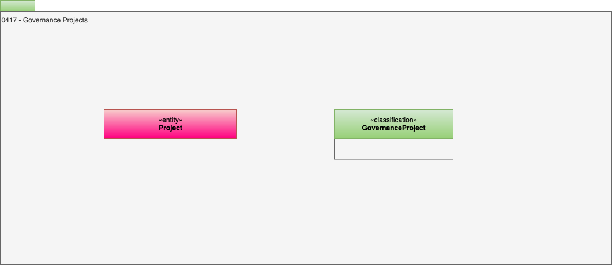

---
hide:
- toc
---

<!-- SPDX-License-Identifier: CC-BY-4.0 -->
<!-- Copyright Contributors to the ODPi Egeria project. -->

# 0417 Governance Projects

The roll-out of a governance program is typically divided into projects that are grouped together into a campaign (see [Projects](/types/1/0130-Projects) in Area 1).
The **GovernanceProject** classification tags these projects to make it easy for the governance team to identify them.

--8<-- "snippets/abbr.md"