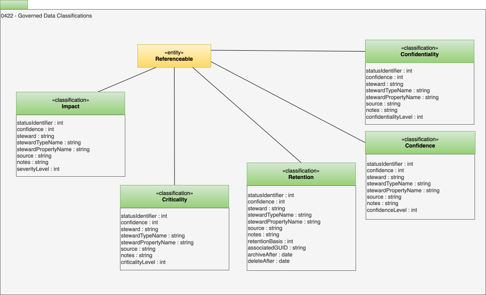

---
hide:
- toc
---

<!-- SPDX-License-Identifier: CC-BY-4.0 -->
<!-- Copyright Contributors to the ODPi Egeria project. -->

# 0422 Governed Data Classifications

Governed Data Classifications describe the common (ie typical) types of classifications
that are used in the governance controls for the data governance domain.

* *Impact* describes the impact of a situation on a particular resource.
* *Criticality* describes how critical a resource is to the operations of the organization.
* *Confidentiality* typically is used with a data resource and indicates how confidential its content is.
* *Confidence* indicates how confident the organization in the use of this resource in terms of its quality.
* *Retention* defines how long a resource (typically a data resource) needs to be kept.

The values used in *statusIdentifier*, *levelIdentifier*, *severityLevelIdentifier* and *basisIdentifier* are define using
[Valid Metadata Values](/guides/planning/valid-values/overview).

## Confidence classification

Defines the level of confidence that should be placed in the accuracy of related data items.

* *confidenceLevel* - Level of certainty in the accuracy of the results.
* *confidence* - Level of confidence in the correctness of the element. 0=unknown; 1=low confidence; 100=total confidence.
* *statusIdentifier* - Defines the status values of a governance action classification.
* *steward* - Unique identifier for the steward performing the action.
* *stewardTypeName* - Type name of the Actor entity identifying the steward.
* *stewardPropertyName* - Property name for the steward's unique identifier (typically guid or qualifiedName).
* *source* - Details of the organization, person or process that created the element, or provided the information used to create the element.
* *notes* - Notes on why decision were made relating to this element, and other useful information.

## Confidentiality classification

Defines the level of confidentiality of related data items.

* *confidentialityLevel* - Defines the level of confidence to place in the accuracy of a data item.
* *confidence* - Level of confidence in the correctness of the element. 0=unknown; 1=low confidence; 100=total confidence.
* *steward* - Unique identifier for the steward performing the action.
* *statusIdentifier* - Defines the status values of a governance action classification.
* *stewardTypeName* - Type name of the Actor entity identifying the steward.
* *stewardPropertyName* - Property name for the steward's unique identifier (typically guid or qualifiedName).
* *source* - Details of the organization, person or process that created the element, or provided the information used to create the element.
* *notes* - Notes on why decision were made relating to this element, and other useful information.

## Criticality classification

Defines how critical the related data items are to the organization.

* *criticalityLevel* - Defines how important a data item is to the organization.
* *confidence* - Level of confidence in the correctness of the element. 0=unknown; 1=low confidence; 100=total confidence.
* *statusIdentifier* - Defines the status values of a governance action classification.
* *steward* - Unique identifier for the steward performing the action.
* *stewardTypeName* - Type name of the Actor entity identifying the steward.
* *stewardPropertyName* - Property name for the steward's unique identifier (typically guid or qualifiedName).
* *source* - Details of the organization, person or process that created the element, or provided the information used to create the element.
* *notes* - Notes on why decision were made relating to this element, and other useful information.

## Impact classification

Defines the severity of a situation described in the attached entity.

* *severityLevel* - How severe is the impact on the resource?
* *confidence* - Level of confidence in the correctness of the element. 0=unknown; 1=low confidence; 100=total confidence.
* *steward* - Unique identifier for the steward performing the action.
* *statusIdentifier* - Defines the status values of a governance action classification.
* *stewardTypeName* - Type name of the Actor entity identifying the steward.
* *stewardPropertyName* - Property name for the steward's unique identifier (typically guid or qualifiedName).
* *source* - Details of the organization, person or process that created the element, or provided the information used to create the element.
* *notes* - Notes on why decision were made relating to this element, and other useful information.

## Retention classification

Defines the retention requirements for related data items.

* *retentionBasis* - Defines the retention requirements associated with a data item.
* *confidence* - Level of confidence in the correctness of the element. 0=unknown; 1=low confidence; 100=total confidence.
* *statusIdentifier* - Defines the status values of a governance action classification.
* *steward* - Unique identifier for the steward performing the action.
* *stewardTypeName* - Type name of the Actor entity identifying the steward.
* *stewardPropertyName* - Property name for the steward's unique identifier (typically guid or qualifiedName).
* *source* - Details of the organization, person or process that created the element, or provided the information used to create the element.
* *notes* - Notes on why decision were made relating to this element, and other useful information.
* *associatedGUID* - Related entity used to determine the retention period.
* *archiveAfter* - Date when archiving can take place.
* *deleteAfter* - Date when delete can take place.

--8<-- "snippets/abbr.md"