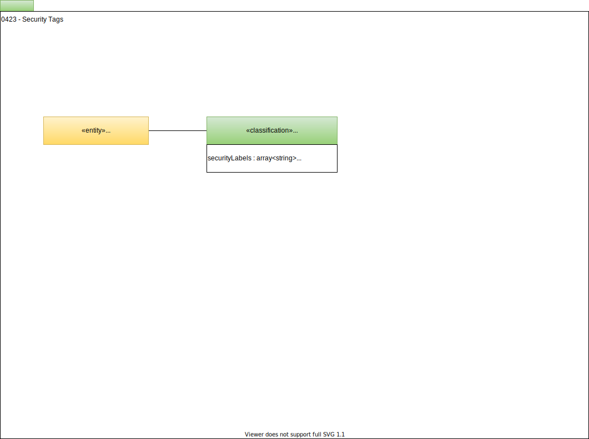

---
hide:
- toc
---

<!-- SPDX-License-Identifier: CC-BY-4.0 -->
<!-- Copyright Contributors to the ODPi Egeria project. -->

# 0423 Security Tags

Security Tags can be attached to assets or schema elements to drive the
rules inside a security engine.

--8<-- "snippets/abbr.md"