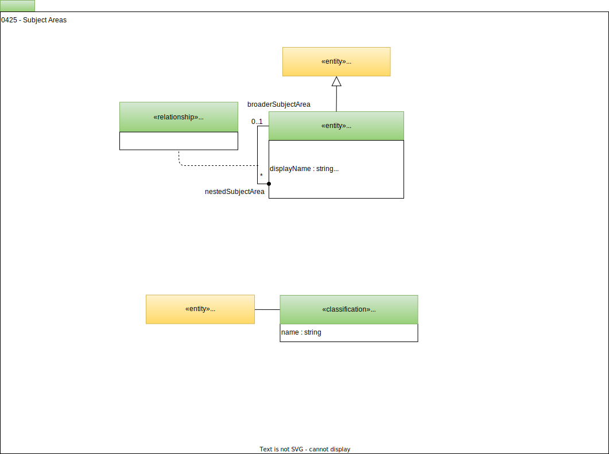

<!-- SPDX-License-Identifier: CC-BY-4.0 -->
<!-- Copyright Contributors to the ODPi Egeria project 2020. -->

# 0425 Subject Areas

[Subject areas](/concepts/subject-area) are topic areas that are important to the organization.  Typically, they cover data that is widely shared across the organization and there is business value in maintaining consistency in the data values in each copy.  

## SubjectAreaDefinition entity

The role of the subject area definition is to act as a collection point for all the subject area materials. This includes:

* A [glossary of terms](/types/3/0310-Glossary) that describe the key concepts in the subject area.
* Lists and hierarchies of [reference data](/types/5/0545-Reference-Data) that relate to particular data values in the subject area.
* [Quality rules](/types/4/0430-Technical-Controls) for specific data values in the subject area.
* Preferred [data structures and schemas](/types/5/0501-Schema-Elements).

Creating the subject area definition is a declaration that data about this subject area is of significance to the organization and will be receiving special attention.

The subject area definition can be linked to the [governance definitions](/types/4/0401-Governance-Definitions) via the [*GovernanceBy*](/types/4/0401-Governance-Definitions) relationship.

## SubjectAreaHierarchy relationship

A subject area may be subdivided into more specific subject areas.  The subject areas can be linked together into a hierarchy using *SubjectAreaHierarchy* relationships.

## SubjectArea classification

Elements that are part of the materials for a subject area are classified with the *SubjectArea* classification.  The *name* attribute in the classification matches the *subjectAreaName* attribute in the *SubjectAreaDefinition*.

This classification makes it easy to locate all the subject area's content.

??? deprecated "Deprecated types"
    - *SubjectAreaGovernance* - use [GovernedBy](/types/4/0401-Governance-Definitions) relationship instead.

--8<-- "snippets/abbr.md"