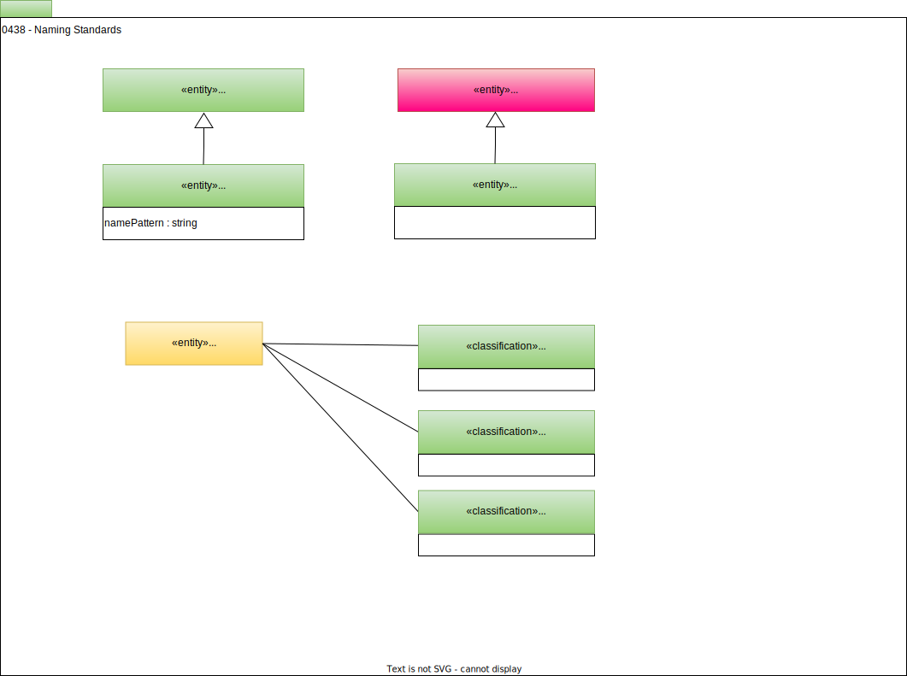

<!-- SPDX-License-Identifier: CC-BY-4.0 -->
<!-- Copyright Contributors to the ODPi Egeria project. -->

# 0438 Naming Standards

Naming standards are structured rules and conventions used to create consistent, clear, and meaningful names across systems, code, documents, or assets.

## Purpose of Naming Standards

Naming standards ensure clarity, consistency, and traceability. They help users, developers, and administrators quickly understand the purpose, type, and context of an entity, whether it's a variable in code, a server in IT infrastructure, or a government standard. Proper naming reduces errors, improves collaboration, and supports automation and scalability.

### Key Principles Across Domains

* Clarity and Meaningfulness: Names should clearly describe the entity's function or purpose. Avoid jargon or ambiguous abbreviations.
* Consistency: Apply the same format and rules across all similar entities to maintain uniformity.
* Context Inclusion: Include relevant context such as location, environment, or type (for example, PRD/DEV/TST for IT environments) to make names self-explanatory.
* Scalability: Design names to accommodate growth, such as using leading zeros for sequential numbering.
* Avoid Special Characters and Spaces: Use hyphens or underscores instead of spaces to ensure compatibility with scripts, URLs, and programming languages.

### Examples by Domain

* Programming: Naming conventions define rules for variables, functions, classes, and types. Common practices include camelCase, PascalCase, snake_case, and Hungarian notation to indicate type or purpose.
* IT Infrastructure: Servers, devices, and files are named to encode location, role, environment, and sequence. Example: NYC-DB-PRD-01 indicates a production database in New York City.
* Government Standards: Titles should reflect function in plain English, with unique identification numbers (e.g., GovS 001.1) and versioning (major: 1.0, minor: 1.1, drafts: 1.1 Draft A).
* Healthcare Systems: Unique identifiers like NHS Numbers or SNOMED CT codes follow standardized naming to ensure interoperability and machine readability standards.

### Best Practices

* Document and Enforce: Maintain a reference guide for all naming conventions and ensure team-wide adherence.
* Human-Readable: Names should be understandable without a glossary.
* Versioning and Status: Track versions and status clearly to manage updates and revisions.
* Review Regularly: Reassess naming conventions periodically or after major system changes to maintain relevance.
* By following these principles, organizations can achieve efficient communication, easier maintenance, and reliable automation across all systems and projects.

## NamingStandardRule entity

The *NamingStandardRule* entity is a [GovernanceControl](/types/4/0420-Governance-Controls) that describes a naming standard rule.  This includes the naming patterns it supports.

## NamingStandardRuleSet entity

The *NamingStandardRuleSet* entity is a [Collection](/types/0/0021-Collections) of naming standard rules.

## Glossary term classifications

When we are naming data items, it is useful to have a glossary of name parts that can be combined to form consistent names. The classifications below are used to classify the type of name part that a glossary term represents.  

Using this type of approach reduces the number of glossary terms needed to define a naming convention.

### PrimeWord classification

The *PrimeWord* classification is typically attached to a [GlossaryTerm](/types/3/0330-Terms) used to describe the type of word that is considered a prime word.

Prime words are nouns that describe the subject area of the data, such as "Employee" or "Company." 

### Modifier classification
The *Modifier* classification is used to describe the type of word that is considered a modifier.

Modifiers further qualify or distinguish the prime and class words, helping to make the object name clear and unique. For example, "First" or "Annual" can be used as modifiers.

### ClassWord classification
The *ClassWord* classification is used to describe the type of word that is considered a class word.

Class words are words that identify a distinct category or classification of data, such as "Rate" or "Name." These components work together to create a comprehensive naming system that is consistent and understandable across the organization.

--8<-- "snippets/abbr.md"