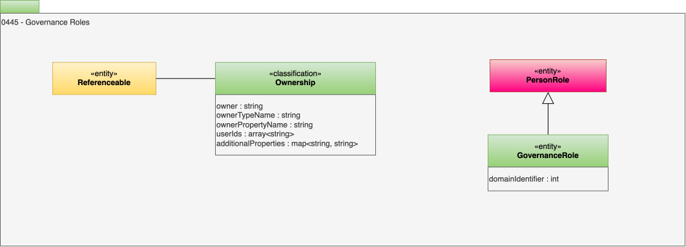

<!-- SPDX-License-Identifier: CC-BY-4.0 -->
<!-- Copyright Contributors to the ODPi Egeria project. -->

# 0445 Governance Roles

Although we aim to automate governance as much as possible, it is often necessary to assign responsibility for specific actions to specific people.

> Figure 1: Assignment of Governance Roles

## GovernanceRole entity

In Figure 1, the responsibilities of someone assigned to manage a particular aspect of governing a resource or related element ([Referenceable](/types/0/0010-Base-Model)) is represented by a *GovernanceRole* entity. Since *GovernanceRole* inherits from [PersonRole](/types/1/0112-People)an individual is assigned the Governance Role through the [PersonRoleAppointment](/types/1/0112-People)relationship.

* *domainIdentifier* - Identifier of the governance domain that recognizes this process. Zero typically means 'any' domain.

## Ownership classification

Ownership is assigned to an element by adding the *Ownership* classification to it. This classification can assign ownership as an [ActorProfile](/types/1/0110-Actors), [UserIdentity](/types/1/0110-Actors) or [PersonRole](/types/1/0112-People).  The *userIds* property is used by the security connector if you want to restrict access to the resource based on the ownership.

* *owner* - Identifier of the person or process who is accountable for the proper management of the element or related resource.
* *ownerTypeName* - Type of element that describes the owner.
* *ownerPropertyName* - Name of the property from the element used to identify the owner.
* *userIds* - A list of user identifies (userIds).

--8<-- "snippets/abbr.md"