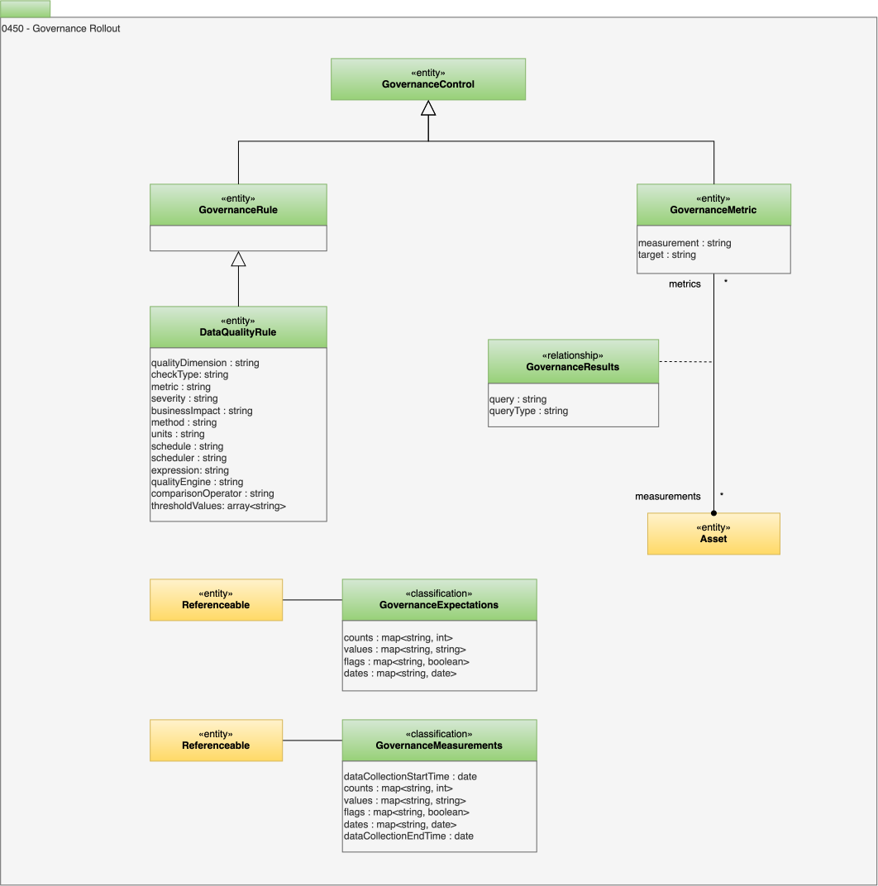

<!-- SPDX-License-Identifier: CC-BY-4.0 -->
<!-- Copyright Contributors to the ODPi Egeria project. -->

# 0450 Governance Rollout

An important aspect of the governance program is the ability to measure its effectiveness and identify the activities that are delivering the highest value, or operating with the greatest efficiency etc.

A value (or collection of values) that should be captured to demonstrate the effectiveness of an aspect of the governance program is documented using the *GovernanceMetric* entity.  

The associated measurements for the metric an either be stored in a data source such as a database or file, particularly if it is a lot of data or captured in a classification attached to the element that the data values describe.

## GovernanceRule entity

The *GovernanceRule* entity defines an executable rule that can be deployed at particular points in the processing.
It is a type of [GovernanceControl](/types/4/0420-Governance-Controls).

## GovernanceMetric entity

An important aspect of the governance program is the ability to measure its effectiveness and identify the activities that are delivering the highest value, or operating with the greatest efficiency etc.

A value (or collection of values) that should be captured to demonstrate the effectiveness of an aspect of the governance program is documented using the *GovernanceMetric* entity.  This is a type of [GovernanceControl](/types/4/0420-Governance-Controls).

The associated measurements for the metric an either be stored in a data source such as a database or file, particularly if it is a lot of data or captured in a classification attached to the element that the data values describe.

* *measurement* - Format or description of the measurements captured for this metric.
* *target* - Definition of the measurement values that the governance definitions are trying to achieve.

## GovernanceExpectations classification

The calculation of governance metrics is often a summary of many other measurements each associated with different resources (such as data sources and processes).
These resources are catalogued as [Assets](/types/0/0010-Base-Model).
The definition of their expected behaviour or content can be captured using the *GovernanceExpectations* classification attached to their Asset.

* *counts* - A set of metric name to count value pairs.
* *values* - A set of metric name to string value pairs.
* *flags* - A set of metric name to boolean value pairs.
* *dates* - A set of metric name to date value pairs.

## GovernanceMeasurements classification

The measurements that support the assessment of a particular resource can be gathered and stored in a *GovernanceMeasurements* classification attached to its Asset.

* *dataCollectionStartTime* - If the data is bound by time, this is the start time.
* *counts* - A set of metric name to count value pairs.
* *values* - A set of metric name to string value pairs.
* *flags* - A set of metric name to boolean value pairs.
* *dates* - A set of metric name to date value pairs.
* *dataCollectionEndTime* - If the data is bound by time, this is the end time.

## GovernanceResults relationship

Alternatively, if it is easier to gather the measurements in an external data source, the asset that describes this data source can be linked to the appropriate governance metrics using the *GovernanceResults* relationship.

The *queryType* and *query* attributes of this relationship capture the query used to retrieve the relevant data for the metric.

* *query* - Query used to extract data, can include placeholders.
* *queryType* - Type of query used to extract data.

--8<-- "snippets/abbr.md"