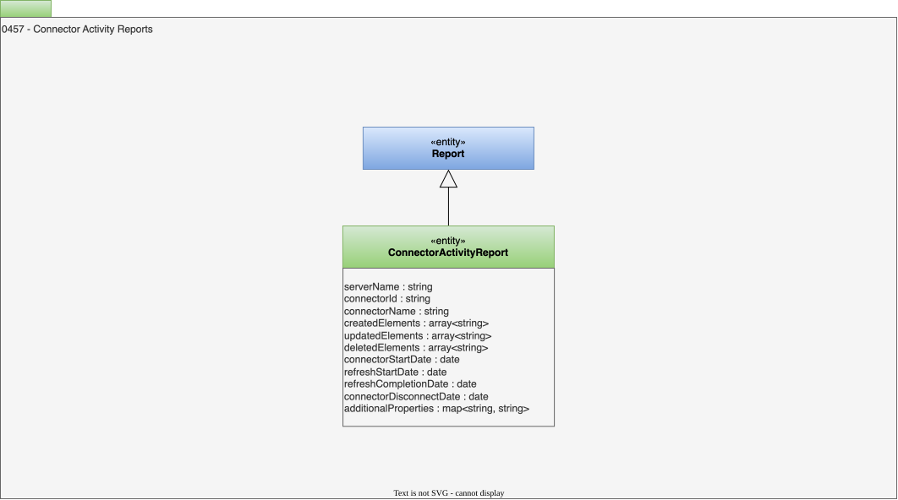

<!-- SPDX-License-Identifier: CC-BY-4.0 -->
<!-- Copyright Contributors to the ODPi Egeria project. -->

# 0457 Connector Activity Reports

## ConnectorActivityReport entity

The *ConnectorActivityReport* entity describes the updates made by an [integration connector](/concepts/integration-connector) during a single call to its `refresh()` method or the operations of an instance of a [governance service](/concepts/governance-service).  A report is only created if the connector made changes (create, update, delete) to the metadata.

The attributes are as follows:

* *serverName* - name of the [integration daemon](/concepts/integration-daemon) where the integration connector is running/ran or the [engine host](/concepts/engine-host) where the governance service ran.
* *connectorId* : unique identifier of the connector.  This is either the unique identifier (guid) of the [RegisteredIntegrationConnector](/types/4/0464-Dynamic-Integration-Groups) relationship that links the integration connector into a running integration group OR the unique identifier of the [SupportedGovernanceService](/types/4/0461-Governance-Engines) relationship that identified the governance service to run.
* *connectorName* : name of the connector.  This is either set in the integration daemon's configuration document or it is the unique identifier (guid) of the *RegisteredIntegrationConnector* relationship that links the integration connector into a running integration group.
* *additionalProperties* - additional properties of importance to the integration connector.

* *connectorStartDate* - Date/time when the connector's start() was called.
* *refreshStartDate* - Date/time when the connector's refresh() was called.
* *refreshCompletionDate* - Date/time when the connector returned from the refresh() call.
* *connectorDisconnectDate* - Date/time when the connector's disconnect() was called.
* *createdElements* - List of elements that were created.
* *updatedElements* - List of elements that were updated.
* *deletedElements* - List of elements that were deleted.

--8<-- "snippets/abbr.md"