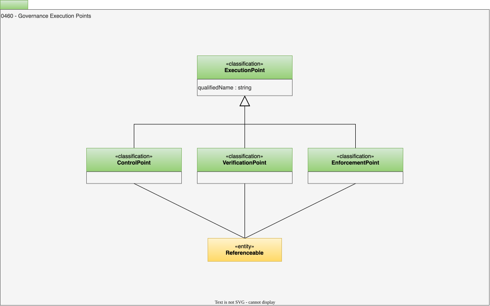

<!-- SPDX-License-Identifier: CC-BY-4.0 -->
<!-- Copyright Contributors to the ODPi Egeria project. -->

# 0460 Governance Execution Points

A [*governance execution point*](/concepts/governance-execution-point) defines specific activity that is implementing a requirement of the governance program.  

## ExecutionPoint classification

An execution point is represented by the *ExecutionPoint* classification, attached to the
[Referenceable](/types/0/0010-Base-Model) that implements it.  It has one attribute:

* *qualifiedName* - the qualified name of the governance definition that this execution point implements.

Execution points label the implementation components that carry out a requirement of the governance
program - typically elements such as:

* [Governance Action Process Steps](/types/4/0462-Governance-Action-Processes)
* [Engine Actions](/types/4/0463-Engine-Actions)
* [Processes](/types/0/0010-Base-Model)

Recording the *qualifiedName* of the governance definition alongside the running component makes it
possible to correlate the component's activity with the governance definitions it serves, and can be
used to drive additional audit logging while that component runs.  The governance definitions referred
to are usually [Governance Controls](/types/4/0420-Governance-Controls).

The three subtypes below distinguish what kind of activity the component performs.

## ControlPoint classification

*ControlPoint* describes a decision that must be made to resolve a situation.  The decision is
typically passed to a human, but it could be an analytical process.

## VerificationPoint classification

*VerificationPoint* describes a test that must be made to determine whether a particular condition is
true.  The result is logged, and follow-on actions are typically initiated if the result is not what
was expected.

## EnforcementPoint classification

*EnforcementPoint* describes an action that is taken to enforce a governance control.

--8<-- "snippets/abbr.md"