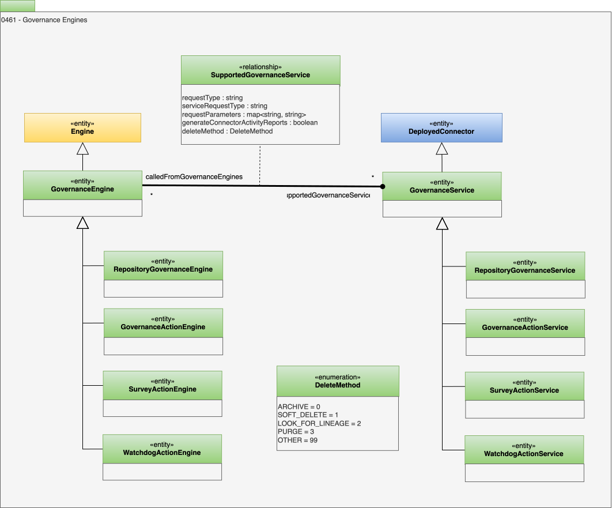

<!-- SPDX-License-Identifier: CC-BY-4.0 -->
<!-- Copyright Contributors to the ODPi Egeria project. -->

# 0461 Governance Engines

The governance engine types in this model are used to create a [governance engine definition](/concepts/governance-engine-definition).

## GovernanceEngine entity

A [governance engine](/concepts/governance-engine) is a [software capability](/types/0/0042-Software-Capabilities) that is able to run specific services on demand.  These services, called [governance services](/concepts/governance-service), typically implement specific logic that is needed to govern an organization's resources or the metadata associated with them.

Open metadata recognizes five types of governance engine:

* *GovernanceActionEngine* - [Governance action engines and services](/concepts/governance-action-engine) support the active governance of metadata and the resources they represent.  There are different types of governance action engines/services that are defined by the [Open Governance Framework (OGF)](/frameworks/ogf/overview).
* *RepositoryGovernanceEngine* - [Repository governance engines and services](/concepts/repository-governance-engine) support the maintenance of repository level concerns, such as monitoring audit logs and maintaining [open metadata archives](/concepts/open-metadata-archive) that are defined in the [Open Metadata Repository Services (OMRS)](/services/omrs).
* *SurveyActionEngine* - [Survey action engines and services](/concepts/survey-action-engine) support the analysis of [digital resources](/concepts/digital-resource).  The results of this analysis are stored in a [survey report](/types/6/0603-Survey-Reports) chained off of the corresponding [Asset](/types/0/0010-Base-Model) metadata element. The interfaces for surveys are found in the  [Open Survey Framework (OSF)](/frameworks/osf/overview).  
* *WatchdogActionEngine* - [Watchdog action engines and services](/concepts/watchdog-action-engine) support the monitoring of resources and situations/events, notifying subscribers when they occur.  Unlike the other types of governance engine, a watchdog action service is expected to keep running for as long as the situation needs watching, rather than completing quickly.  The interfaces for watchdog action services are found in the [Open Watchdog Framework (OWF)](/frameworks/owf/overview).
* *ExplorerActionEngine* - Explorer action engines and services support the exploration of digital resources initially as part of the resource explorer.  This definition is to support an interchange between the resource explorer and the OMAG Server Platform/Engine Host.  

## SupportedGovernanceService relationship

The capability of a *governance engine* is specified via the *SupportedGovernanceService* relationships.  

The `requestType` attribute in this relationship is the caller's request type (known as the [governance request type](/concepts/governance-request-type)).  The `serviceRequestType` attribute maps the *governance request type* to a request type supported by the associated [governance service](#governanceservice-entity).  If `serviceRequestType` is null, the governance request type is used when calling the governance service.

Each governance request type linked to a specific governance engine must be unique.

The `requestParameters` provide initial values of the request parameters passed to the governance services when it is called.  These are overridden by any request parameters supplied by the caller.

The `generateIntegrationReport` configures whether an [integration report](/concepts/integration-report) of the metadata creates, updates and deletes performed by a call to this service is created.

* *requestType* - The request type used to call the governance service.
* *serviceRequestType* - Request type supported by the governance service (overrides requestType on call to governance service if specified).
* *requestParameters* - Request parameters to pass to the governance service when called.
* *generateConnectorActivityReports* - Should the service/connector create integration reports based on its activity? (Default is true.).
* *deleteMethod* - Identifies which type of delete to use.

## GovernanceService entity

*[Governance services](/concepts/governance-service)* are specialist [connectors](/concepts/connector).  They are represented in open metadata using the *GovernanceService* entity which is a specialization of *[DeployedConnector`](/types/2/0215-Software-Components)*.  This entity is linked to a *[Connection](/types/2/0201-Connectors-and-Connections)* entity via a *[ConnectionToAsset](/types/2/0205-Connection-Linkage)* relationship.

A governance service can be linked to multiple governance engines via the *SupportedGovernanceService* relationship.  It can be linked to the same governance engine multiple times as long as each *SupportedGovernanceService* relationship has a different governance request type.

The subtype of the governance service linked via the *SupportedGovernanceService* relationship should be consistent with the subtype of the associated governance engine.  For example:

* A *GovernanceActionService* is linked to a *GovernanceActionEngine*.
* A *SurveyActionService* is linked to an *SurveyActionService*.
* A *RepositoryGovernanceService* is linked to a *RepositoryGovernanceEngine*.
* A *WatchdogActionService* is linked to a *WatchdogActionEngine*.
* A *ExplorerActionService* is linked to a *ExplorerActionEngine*.

## DeleteMethod enumeration

*DeleteMethod* defines the the type of delete method to use when the connector/governance service deletes an element.

| Enumeration      | Value | Name                  | Description                                                                                                                                                                                                                                                                                                                 |
|------------------|-------|-----------------------|-----------------------------------------------------------------------------------------------------------------------------------------------------------------------------------------------------------------------------------------------------------------------------------------------------------------------------|
| ARCHIVE          | 0     | "Archive Element"     | This is the default value.  The element is marked with the [Memento](/types/0/0010-Base-Model) classification which means it is no longer returned on normal queries.  However if the `forLineage=true` option is used on a query, the element is returned.  This mechanism is ued to preserve metadata for lineage graphs. |
| SOFT_DELETE      | 1     | "Soft-delete Element" | The element is moved to DELETED status so that is no longer returned on queries.  However, it is still in the repository and can be restored into the active repository if it was deleted by accident.                                                                                                                      |
| LOOK_FOR_LINEAGE | 2     | "Look for Lineage"    | If the element is linked into lineage, it is archived, otherwise it is soft-deleted.  However, it is still in the repository and can be restored into the active repository if it was deleted by accident.                                                                                                                  |
| PURGE            | 3     | "Purge"               | The element is removed from the active repository. It cannot be restored automatically.                                                                                                                                                                                                                                     |
| OTHER            | 99    | "Other"               | Another type of delete process not supported by Egeria.                                                                                                                                                                                                                                                                     |

??? education "Further information"

    The [Open Metadata Engine Services (OMES)](/services/omes) support the implementation of each type of governance engine. They run in an [Engine Host](/concepts/engine-host) OMAG Server and draw their configuration from the  *GovernanceEngine* and the linked *GovernanceService* elements in the associated metadata server.

## ExplorerActionEngine entity

A governance engine that is supported by tools such as the Resource Explorer. It is typically part of a process to scout, discover and select digital resources for a particular purpose.

## ExplorerActionService entity

A governance service representing an action that can be executed by Resource Explorer.

## GovernanceActionEngine entity

A collection of related governance services of the same type from the Open Governance Framework (OGF).

## GovernanceActionService entity

A governance service that conforms to the Open Governance Framework (OGF).

## RepositoryGovernanceEngine entity

A governance engine for open metadata repositories.

## RepositoryGovernanceService entity

A governance service for open metadata repositories.

## SurveyActionEngine entity

A governance engine for managing the surveying of real-world resources and capturing the results in survey report attached to the associated asset.

## SurveyActionService entity

A governance service for managing the surveying of real-world resources and capturing the results in survey report attached to the associated asset.

## WatchdogActionEngine entity

A governance engine for managing the monitoring of resources and situations/events and then notifying subscribers when they occur.

## WatchdogActionService entity

A governance service for managing the monitoring of resources and situations/events and then notifying subscribers when they occur.

--8<-- "snippets/abbr.md"