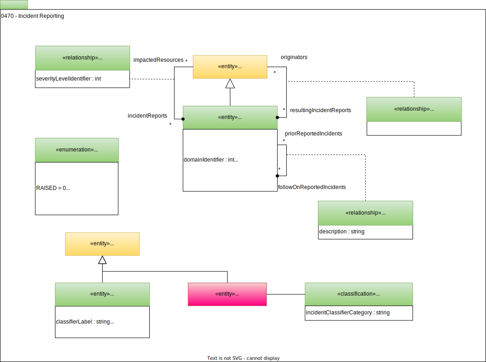

<!-- SPDX-License-Identifier: CC-BY-4.0 -->
<!-- Copyright Contributors to the ODPi Egeria project. -->

# 0470 Incident Reporting

The incident report is used to record that an incident (such as data breach, software error, quality failure detected) has occurred.  Many organizations have a dedicated incident management system (such as ServiceNow, GitHub or Jira).  Open metadata supports the management of incident reports, either directly, or as a proxy to an incident in an incident management system.  Where the incident is described in open metadata, it can be linked to the assets that are affected and its resolution can be governed through governance action processes.

An incident report may be related to the [context event(s)](/types/4/0475-Context-Events) that describe the root cause of the incident via the [ContextEventEvidence](/types/4/0475-Context-Events) relationship.

## IncidentReport entity

The *IncidentReport* entity is a [*Referenceable*](/types/0/0010-Base-Model) that describes the incident, when it occurred and its current status.

## IncidentReportStatus enumeration

The *IncidentReportStatus* enumeration provides the valid values for the status describing the progress made to resolving the issue described in the incident report.

* Raised - The incident report has been raised but no processing has occurred.
* Reviewed - The incident report has been reviewed, possibly classified but no action has been taken.
* Validated - The incident report records a valid incident and work is underway to resolve it.
* Resolved - The reported incident has been resolved.
* Invalid - The incident report does not describe a valid incident and has been closed.
* Ignored - The incident report is valid but has been closed with no action.
* Other - Another incident report status.

## ImpactedResource relationship

The *ImpactedResource* relationship allows an *IncidentReport* entity to be linked to [*Referenceable*](/types/0/0010-Base-Model) entities that describe resources that are impacted by the incident.  For example, it may link an incident report to a [*SoftwareServer*](/types/0/0040-Software-Servers) that is unavailable.  The *severityLevelIdentifier* describes the severity of the impact on the *Referenceable* entity.  Its value is taken from the list of severities defined in the [GovernanceClassificationLevel](/types/4/0421-Governance-Classification-Levels) collection for severity levels.

## IncidentOriginator relationship

The *IncidentOriginator* links the *IncidentReport* entity to the [*Actor*](/types/1/0110-Actors) or [*Process*](/types/0/0010-Base-Model) that created the incident report.

## IncidentDependency relationship

The *IncidentDependency* relationship allows related *IncidentReport* entities to be linked together.  The *description* property describes the relationship.

## IncidentClassifier entity

The *IncidentClassifier* entity describes a valid value for an entry in the *incidentClassifier* map of the *IncidentReport* entity.  

* *classifierLabel* is used as a unique name for the classifier for incident management systems that us a string as a classifier.
* *classifierIdentifier* is the unique identifier for the classifier, associated with the classifier label in the incident report.  It is used with incident management systems that use a number in its classifier definition.
* *classifierName* is used as a display name for the classifier.
* *classifierDescription* is used to provide more information on how the classifier should be used and its significance.

## IncidentClassifierSet classification

The *IncidentClassifier* entities allow an organization to define their own classifiers.  They are grouped together into one or more collections to make them easy to locate.  For example, there may be a collection of classifiers used in security incidents; another for system outages.

The *IncidentClassifierSet* classification identifies a collection that contains a list of *IncidentClassifier* entities.

--8<-- "snippets/abbr.md"