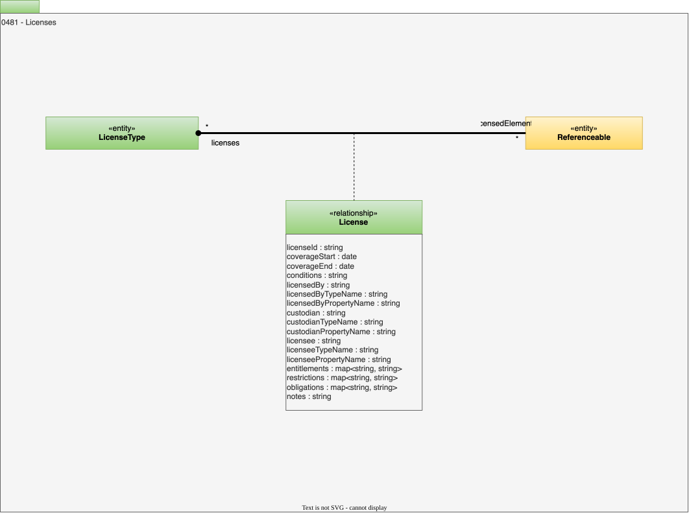

---
hide:
- toc
---

<!-- SPDX-License-Identifier: CC-BY-4.0 -->
<!-- Copyright Contributors to the ODPi Egeria project. -->

# 0481 Licenses

The data economy brings licensing to data and metadata.  Even open data typically has a license.

The license will define the permitted uses and other requirements for using the asset.

Details of a type of license are described in a [*LicenseType*](/types/4/0440-Organizational-Controls). 

The element that is licensed is identified with the *License* relationship. This relationship is a *multi-link* relationship so the same license type, with different dates, can be linked to the same element.

## License relationship

Link between a resource description and its license.

* *licenseId* - Unique identifier of the actual license.
* *coverageStart* - Start date for the certification/license.
* *coverageEnd* - End date for the certification/license.
* *conditions* - Any special conditions or endorsements over the basic certification/license type.
* *licensedBy* - Person or organization awarding the license.
* *licensedByTypeName* - Type of element referenced in the licensedBy property.
* *licensedByPropertyName* - Name of the property from the element used to identify the licensedBy property.
* *custodian* - The person, engine or organization that will ensure the certification/license is honored.
* *custodianTypeName* - Type of element referenced in the custodian property.
* *custodianPropertyName* - Name of the property from the element used to identify the custodian property.
* *licensee* - The person or organization that received the license.
* *licenseeTypeName* - Type of element referenced in the licensee property.
* *licenseePropertyName* - Name of the property from the element used to identify the licensee property.
* *entitlements* - The named list of rights and permissions granted.
* *restrictions* - The named list of limiting conditions or measures imposed.
* *obligations* - The named list of actions, duties, or commitments required.
* *notes* - Notes on why decision were made relating to this element, and other useful information.

--8<-- "snippets/abbr.md"