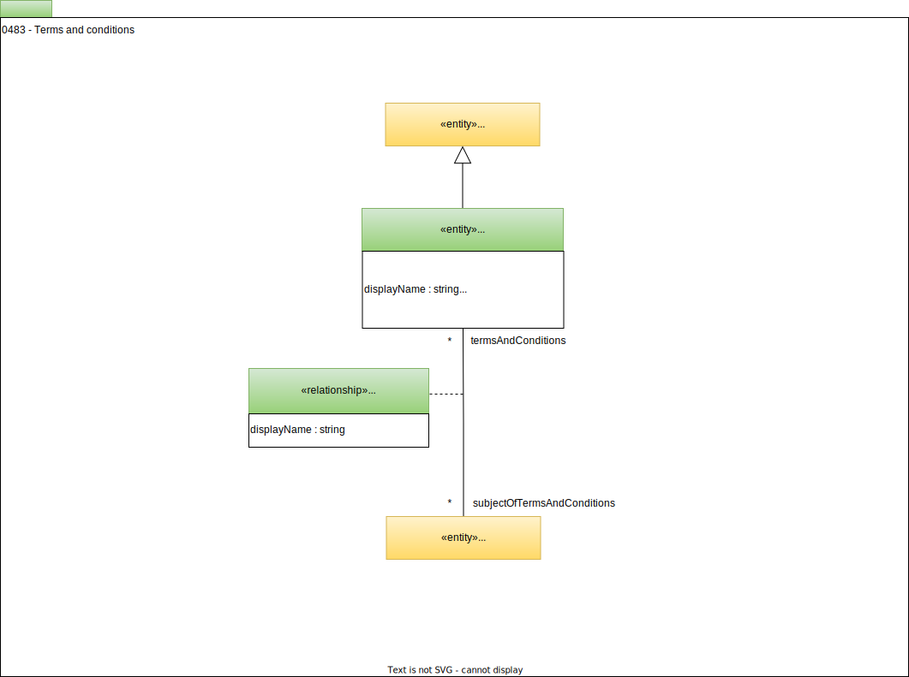

---
hide:
- toc
---

<!-- SPDX-License-Identifier: CC-BY-4.0 -->
<!-- Copyright Contributors to the ODPi Egeria project. -->

# 0483 Terms and Conditions

The *TermsAndConditions* entity identifies the rules relating the use of an element (or the associated real-world [resource](/concepts/resource)).

*AttachedTermsAndConditions* relationships attach the terms and conditions to element that details where these terms and conditions apply.  They are typically attached to a [LicenseType](/types/4/0482-Licences), [Agreements](/types/4/0484-Agreements) and [AgreementItems](/types/4/0484-Agreements).

--8<-- "snippets/abbr.md"